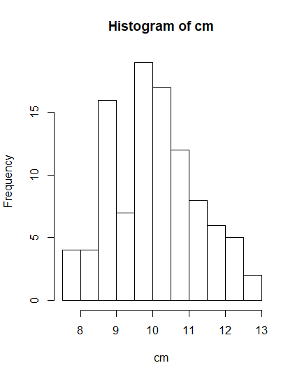
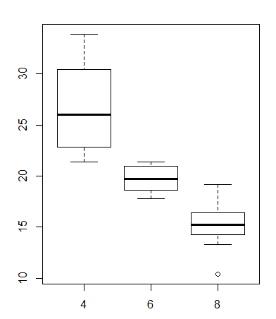

[TOC]

# Swirl Setup

```R
# Setup
install.packages("swirl")
packageVersion("swirl")
library(swirl) # load swirl
install_from_swirl("R Programming") #install R programming course
swirl() # run swirl
```

```R
# Clearing variables in workspace
rm(list=ls())
```

**Info**

```R
| When you are at the R prompt (>):
| -- Typing skip() allows you to skip the current question.
| -- Typing play() lets you experiment with R on your own; swirl will ignore what
| you do...
| -- UNTIL you type nxt() which will regain swirl's attention.
| -- Typing bye() causes swirl to exit. Your progress will be saved.
| -- Typing main() returns you to swirl's main menu.
| -- Typing info() displays these options again.
```

# Vectors

Numbers are considered vectors of length one

```R
z<-c(1,2,3)
c(z,z)
> 1 2 3 1 2 3
# Nesting vectors creats a flat vector
```

**Vector Arithmetic**

When given two vectors of the same length, R simply performs the specified arithmetic operation (`+`, `-`, `*`, etc.) element-by-element. If the vectors are of different lengths, R =='recycles' the shorter vector until it is the same length as the longer vector==.

*NOTE:*

```R
z <- c(1,2,3)
z + 5
# In line 2, '5' is a vector of 1, but R recycles it to a vector of 3 to match z
```

```R
# Notice the recycling that occures
c(1,2,3,4) + c(0,10)
> 1 12 3 14
```

#  Workspace and Files

```R
# List files in dir
list.files()
dir()
```

```R
# See arguembtns
args(<|fucntion|>)
```

```R
# Create Directory
dir.create("<|dir name|>")

# Create file
file.create("<|file name|>")
```

```R
# In order to create nested directories, 'recursive' must be set to TRUE.
dir.create(file.path("testdir2","testdir3"), recursive = TRUE)
```

**NOTE:** The following commands are APIs to make the environment interaction agnostic to windows & unix

```R
# interacting with files

# file properties
file.info()

# Grab a property name
file.info()$<|property name|>
```

```R
# Create relative paths
file.path("folder1","folder2")
> "folder1/folder2"
```

# Sequences

```R
# increments of one
n:m
```

**Seq**

```R
# specify increment value
seq(n,m,by=<|increment value|>)

# specify number of values
seq(n,m,length=<|number of values|>)

# create a list of same length as another list
seq(along.with=<|list|>)
# the same as
seq_along(<|list|>)
```

**Rep**

```R
# contruct repeating sequences
rep(n, times=<|number|>)

# works with vectors
rep(c(), times=<|number|>)

# repeate each individuale element
rep(c(1,2,3), each=<|number|>)
```

# Vectors

Two types:
1) Atomic - one data type
2) List - multiple data types

```R
# Logic
c() <|logic exprsion & condition|>
# this will generate a vector of same length as c() with TRUE / FALSE values
```

```R
# character vectors
# use "" to denote character objects
c("string1","string2")
```

**Paste**

```R
# collapse the vector into 1 dimension
paste(c(),collapse=<|character to be used between the character objects|>)
```

```R
# combining elements of different vectors together
paste(1:3,c("X","Y","Z"),sep="")
> "1X" "2Y" "3Z"

#If vectors are not of the same size, recycling will occure
```

# Missing Values

`NA` : Missing data - cast on data type
`NaN` : Not a Number (undefined)

```R
# Find NA values logic
is.na(<|object|>)
```

==Note:== `<|object|> == NA` wont work as NA isn't really a value

==Note:== Behind the hood, True is one, false is 0, so summation can be used on boolean objects

```R
sum(c(TRUE,FALSE,TRUE))
> 2
```

# Subsetting vectors

R uses 1 based indexing. It also doesn't stop us from referring out of bound items, `returns NA`

```R
# Index subsetting
x[n:m]
# OR 
x[c(<|specific index values|>)]
```

```R
# Exclusionary Selection, use negatives in a list
#Example, return all values besides 2nd and 10th element
x[c(-2,-10)]
# or 
x[-c(2,10)]
```

## Logic Subsettings

```R
# Example: return non-NA values
x[!is.na(x)]
```

```R
# Example: Select elements in another list - using matching
x[x %in% 1:5]
```

==Note:== `x[is.na(x)]` would return all the NAs in x as `is.na(x)` returns `TRUE` for the positions of `NA`

```R
# Example: Positive numbers in a vector
x[x>0]
```

==Note:== if there are `NA` values in `x`; `x[x>0]` will return all positive values and NA values. $\because$ `NA > 0` evaluates to `NA`

# Named Elements

```R
# Creating Named Elemets
# Example
vect <- c(foo = 11, bar =2,norf=NA)

# Call named element
vect["foo"]
> 11
#or 
vect[c("foo","bar")]
```

```R
# Return names of vector
names(vect)
```

```R
# Adding Named Elements
#Example
vect2 <- c(11,2,NA)
names(vect2) <- c("foo","bar","norf")

#This 
```
# Matrices and DataFrames

A matrix is simply an atomic vector with a dimension attribute

```R
# Create a matrix from a vector
x <- 1:20
# Assign the dim attibutes for x to have 4 rows and 5 columns
dim(x) <- c(4,5)
```

```R
# Create a matrix directly
# Example
matrix(1:20,nrow=4,ncol =5)
```

```R
# Labeling coloums
results <- matrix(1:20,nrow=4,ncol =5)
patients <- c("Bill","Gina","Kelly","Sean")

#combining them
cbind(patients,results)
```

==Note:== The above code will produce a list of `Char objects`. This is due to *coercion*. The solution to this issue is the use of *dataframes*

```R
# Example
# Create a dataframe
results <- matrix(1:20,nrow=4,ncol =5)
patients <- c("Bill","Gina","Kelly","Sean")

data.frame(patients,results)
```

```R
# Setting colNames
cnames <- c("patient","age","weight","bp","rating","test")
colnames(my_data) <- cnames
```

```R
# Getting rows
dataframe[<|rows you want returned|>,]
```

# Data Frames

**Order with multiple columns** - the one desc and the other asc

```R
orderedDF <- csvDF[order(csvDF[outcome.col],rev(csvDF["Hospital.Name"]), na.last = NA),]
#note the rev function
```

# Logic

==Note:== Boolean vectors behave much like arithmetic vectors

## AND

`&` : used to evaluate `AND` across a vector
`&&` : used to evaluate `AND` with the first element of a vector

## OR

`|` : used to evaluate `OR` across a vector
`||` : used to evaluate `OR` with the first element of 
`XOR(<arg1>,<arg2>)`: Exclusive `OR` . i.e `TRUE | TRUE => FALSE` & `FALSE | FALSE => FALSE`

## Logic Functions

```R
# Returns true if expression inside is TRUE
isTRUE(<logic expression>)
```

```R
# Logic for checking identical values (string, boolean, etc)
identical(<value1>,<value2>)
```

## Vector Logic

```R
# Return indicies of vector which are TRUE
which(<logic vector>)
```

```R
# Return True for single TRUE value in vector
any(<logic vector>)
```

```R
# Return TRUE if all vector values are TRUE
all(<logic vector>)
```

# Functions

```R
# Default arguemnts
<function name> <- function(<arg Name> = <default value>){
  
}
```

## Argument Order

[Argument Matching](./Week2.md#argument-matching)

## Passing Functions as Arguments

We can pass functions anonymously in `R`

```R
# defining an anonymouse function
function(x){x+1}
```

## Unpacking `...`

*Note:* Unpacking only works if named arguments are passed into the function

```R
# unpacking
mad_libs <- function(...){
  args <- list(...)
  place <- args[["place"]] #assuming named arguemnt "place" was passed through
  adjective <- args[["adjective"]]
  noun <- args[["noun"]]
}
```

## Define own Binary Operators

Binary operators are functions that accept 2 arguments in the same format as `+,-,*,/`. 

```R
"%mult_add_one%" <- function(left, right){ # Notice the quotation marks and % characters!
   left * right + 1
}
```

```R
# using binary function
4 %mult_add_one% 5
```

==NOTE== Binary operators can be chained together

```R
"%p%" <- function(left,right){ # Remember to add arguments!
  paste(left,right)
}

> 'I' %p% 'love' %p% 'R!'
[1] "I love R!"
```

# Dates and Times

Dates represented by `Date` class
Time represented by `POSIXct` & `POSIXlt `classes

**Storage**

Dates are stored as the number of days since 1970-01-01
Times are stored as either the number of seconds since 1970-01-01 (for `POSIXct`) or a list of seconds, minutes, hours, etc. (for `POSIXlt`).

## Date

```R
# Get Date
Sys.date

#Assigen Date
as.Date("2017-01-01")
```

## Time

```R
# Get Time
Sys.time

> class(t1)
[1] "POSIXct" 
```

```R
# coerce result to POSIXlt
t2 <- as.POSIXlt(Sys.time())
```

==NOTE== While `POSIXct` is just a number of seconds, `POSIXlt` is a list of time values and information.

```R
# Accessing individual elements of time --POSIXlt--
# get minutes
t2$min

# see the rest of the arguemnts 
str(unclass(t2))
```

## Datetime functions

```R
# The following functions work for ANY date or time object
weekdays()

month()

quarters()
```

### Reading external date/time

`strptime` converts character vectors to POSIXlt

```R
t1 <- "October 17, 1986 08:24"
t2 <- strptime(t1,"%B %d, %Y %H:%M") #here we specify the format 
```

### Operations on date & time

Arithmetic and comparisons can be used on these objects.

If more control needed for arithmetic operations, use:

```R
# Arithmatic with unit specification
difftime(<date/time object>,<units>)
```

### Package Suggestion

Check out the `lubridate package` by Hadley Wickham

# Arithmetic 

```R
# mod -> remainder 
<number> %% <number>
```

```R
# standard deviation
sd()
```

# lapply & sapply

***Everything in coursera notes***

# vapply & tapply

## vapply 

sapply() tries to 'guess' the correct format of the result, vapply() allows you to specify it explicitly

vapply is also faster then sapply for large data

```R
# Example
sapply(flags,class) #returns a vector of char(1)
vapply(flags,class,character(1)) #this will explicity cast it to char(1)
#i.e. identical result 
```

## tapply

performing looped functions on data that is grouped

```R
# side tool
# count of each unique grouping
table(dataset$col)
```

```R
# example
split(flags$animate, flags$landmass) #this slipts flags$animate according to the catagories in flags$landmass

# so extending this to tapply
tapply(flags$animate, flags$landmass, mean) #we find the mean on the result of the slected animate col grouped according to landmass
```

# Looking at Data

> * Whenever you're working with a new dataset, the first thing you should do is look at it! What is the format of the data? 
> * What are dimensions? 
> * What are the variable names? 
> * How are they stored? 
> * Are there missing data? 
> * Are there any flaws in the data?

```R
# Overall summary of most of the functions discussed below
str(<data frame>)
```

## Shape & Size

```R
# Dimensions
dim(<data frame>)

nrow(<data frame>)
ncol(<data frame>)
```

```R
# Memory usuage
object.size(<data frame>)
```

## Internal Investigation 

```R
# col names
names(<data frame>)
```

```R
# see subset of data frame
head(<data frame>,<subset size>)
tail(<data frame>,<subset size>)
```

```R
# Get an idea of the count of unique values per row and basic statistical summary depending on data type
# Good for seeing NA count
summary(<datat frame>)
```

==NOTE== *categorical data* is called *factor data* in `R`

> For categorical variables (called 'factor' variables in R), displays the number of times each value (or 'occurs in the data. For example, each value of Scientific_Name only appears once, since it is unique to a specific plant. In the summary for Duration (also a factor variable) tells us that our dataset contains 3031 Perennial plants, 682 Annual plants, etc.

```R
# See levels of each value in a coloum with out dealing with summary truncation
table(<data frame>$<col name>)
```

# Simulation

## Sampling

**Example: ** Simulate 100 flips of an unfair two-sided coin. This particular coin has a 0.3 probability of landing 'tails' and a 0.7 probability of landing 'heads'

```R
sample(c(0,1),100,prob = c(0.3,0.7),replace = TRUE)
```

## Binomail Function

We will look only at `rbinom` for random number generation

> A binomial random variable ***represents the number of 'successes' (heads)*** in a ***given number of independent 'trials' (coin flips).*** Therefore, we can generate a single random variable that represents the number of heads in 100 flips of our unfair coin using rbinom(1, size = 100, prob = 0.7) Note that you only specify the probability of success' (heads) and NOT the probability of 'failure' (tails). Try it now.

```R
rbinom(1, size = 100, prob = 0.7)
> 63
# Number of times 1 was observed in (size=)100 trials 
```

> Equivalently, if we want to see all of the 0s and 1s, we can request 100 observations, each of size 1, with success probability of 0.7. 

```R
rbinom(n = 100, size = 1, prob = 0.7)
> #vector with different coin flip results
# (n=)100 observations outputted with either 1 or 0 depending on probablity
```

## Normal Distribution

==NOTE== **Standard** Normal Distribution (`mean=0`,`sd=1`) is the default function if the arguments `mean` and `sd` aren't specified.

## Poisson distribution

> Simulate 100 *groups* of random numbers, each containing 5 values generated from a Poisson distribution with mean 10

```R
my_pois <- replicate(100,rpois(5,10))
```

***Plotting and Central Limit Theorem Demonstration***

```R
cm <- colMeans(my_pois)
hist(cm)
```



## Other Probability Distributions

* exponential `rexp`
* chi-squared `rchaisq()`
* gamma `rgamma()`

# Basic Graphics 

**Some Advanced Libraries**

* `lattice`
* `ggplot`
* `ggvis`

[Go here for more advanced lessons](http://www.ling.upenn.edu/~joseff/rstudy/week4.html)

## Scatter Plot

```R
# naive plot
plot(<data>)
# R will try produce a graph that best represents the data
# labels taken from coloumns, ticks at round numbers, and other defaults
```

==NOTE== We can specify a lot more, like what is plotted on what axis and how its done so: look at documentation -> `?plot` only has some of the arguments, use `?par`

### Example: Plot red points

```R
plot(<data frame>,col=2)
```

### Example: limit x-axis range plotted

```R
plot(<data frame>,xlim = c(lower,upper))
```

### Example : Shapes

Look at `?points` for assistance

```R
 plot(<data frame>, pch = 2)
```

## Box Plots

### plot "formulas"

> Expression with a tilde ("~") which indicates the relationship between the input variables

```R
# plot the relationship between col1 and col2
boxplot(formula = <col1> ~ <col2>,data = <data frame>)
```

Plot bellow used is plotting the relationship between `mpg ~ cylinders` where cylinders in the data $\in(4,6,8)$ 



## 


# Misc

```R
# unpack an objects content
unclass(<object>)

# determine the object class
class(<object>)
```

```R
# converting
# force an object to belong to a class
as.<object>

# note for dataframes, must use notation that returns the vector and not the dataframe. i.e:
dataframe[,<col>]
```

```R
# convert list printout into compact string view
str(<list object>)
```

```R
# clear enviroment 
rm(list=ls())
```

```R
# Work withing dataset enviroment -> refer to the dataset variables with out needing to restate the dataset name

with(<dataset>,<arg(<"specify the name of the dataset col">)>)
```
