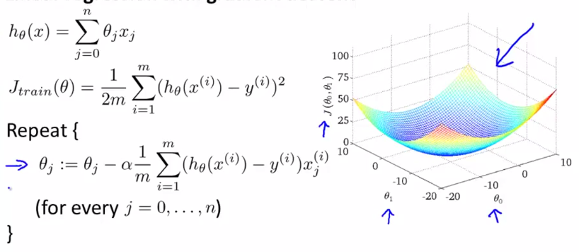

# Week 10 Lecture Notes

[TOC]

# Learning with Large Datasets

We mainly benefit from a very large dataset when our algorithm has high variance when m is small.

 Recall that if our algorithm has high bias, more data will not have any benefit.

Datasets can often approach such sizes as $m = 100,000,000$. In this case, our gradient descent step will have to make a summation over all one hundred million examples. We will want to try to avoid this -- the approaches for doing so are described below.

**NOTE:**
Sanity check with a small sample of $m$ to determine if larger $m$ will actually yield good results.
*Method:* Plot learning curve for a range of values of $m$ and verify that the algorithm has high variance when $m$ is small.

***Example - Revision - Learning Curve***

- The graph on the left has high variance, we can confidently say that adding more data will improve our error.
- The graph on the right has high bias, we can conclude that adding more data will not help improve the error.  

# Stochastic Gradient Descent

Stochastic gradient descent is an alternative to classic (or batch) gradient descent and is more efficient and scalable to large data sets.

***Recap - gradient decent (also called batch gradient descent):***

The gradient decent term $\theta_j$ becomes very expensive when $m>>0$

## Stochastic Gradient Descent (STG)

Stochastic gradient descent is written out in a different but similar way:
$$
cost(\theta,(x^{(i)}, y^{(i)})) = \dfrac{1}{2}(h_{\theta}(x^{(i)}) - y^{(i)})^2
$$
The only difference in the above cost function is the elimination of the m constant within 1/2.
$$
J_{train}(\theta) = \dfrac{1}{m} \displaystyle \sum_{i=1}^m cost(\theta, (x^{(i)}, y^{(i)}))
$$
$J_{train}$ is now just the average of the cost applied to all of our training examples.

**The algorithm is as follows:**

1. Randomly 'shuffle' the dataset
2. Repeat
   1. For $i=1…m$

$$
\theta_j := \theta_j - \alpha (h_{\theta}(x^{(i)}) - y^{(i)}) \cdot x^{(i)}_j
$$

**NOTE:** The repeat statement in the algorithm: in general take between 1-10 passes through the data. The larger the data set, the less pass through we try do. 

This algorithm will only try to fit one training example at a time. This way we can make progress in gradient descent without having to scan all m training examples first. Stochastic gradient descent will be unlikely to converge at the global minimum and will instead wander around it randomly, but usually yields a result that is close enough. Stochastic gradient descent will usually take 1-10 passes through your data set to get near the global minimum.

***Example:***

The red line is batch gradient descent. The Pink line is Stochastic gradient descent. 

STG will take lots of small steps, a random walk, and will eventually reach a region near the optimal solution. *note* it will not converge but instead will randomly walk around the optimal space. 

# Mini-Batch Gradient Descent

Mini-batch gradient descent can sometimes be even faster than stochastic gradient descent. Instead of using all m examples as in batch gradient descent, and instead of using only 1 example as in stochastic gradient descent, we will use some in-between number of examples b.

Typical values for $b$ range from 2-100 or so.

**For example**, 

Let $b=10$ and $m=1000$:

Repeat:

For $i=1,11,21,31,…,991$
$$
\theta_j := \theta_j - \alpha \dfrac{1}{b} \displaystyle \sum_{k=i}^{i+b-1} (h_\theta(x^{(k)}) - y^{(k)})x_j^{(k)}
$$
We're simply summing over ten examples at a time. The advantage of computing more than one example at a time is that we can use vectorized implementations over the $b$ examples. Mini-batch gradient descent tends to only outperform SGD when vectorization is well implemented. 

# Stochastic Gradient Descent Convergence

**Recall:**

**How do we choose the learning rate α for stochastic gradient descent?** Also, how do we debug stochastic gradient descent to make sure it is getting as close as possible to the global optimum?

One strategy is to plot the average cost of the hypothesis applied to every 1000 or so training examples. We can compute and save these costs during the gradient descent iterations.

#### Checking for convergence:

**1)** With a smaller learning rate, it is **possible** that you may get a slightly better solution with stochastic gradient descent. That is because stochastic gradient descent will oscillate and jump around the global minimum, and it will *make smaller random jumps with a smaller learning rate*.

**Example:** 

($\alpha_{red} < \alpha_{blue}$)

**2)** If you *increase the number of examples you average* over to plot the performance of your algorithm, the plot's line will become smoother.

**Example:**

No. average over (red) > No. average over (blue)

**3)** With a very small number of examples for the average, the line will be too noisy and it will be difficult to find the trend.

**Example:**

No. average over (red) >> No. average over (blue)

**NOTE:**

If the learning curve looks remains flat as the No. of points averaged over is increased, this points towards the algorithms diverging. Possible solutions: change features, and learning rate.

**4) Diverging**

If the learning rate increases, then we must use a smaller learning rate $\alpha$

**5)** Getting SGD to converge 

One strategy for trying to actually converge at the global minimum is to **slowly decrease α over time**. For example $\alpha = \dfrac{const1}{iterationNumber + const2}$

However, this is not often done because people don't want to have to fiddle with even more parameters ($const1, const2$).

**Example:**

As the algorithm gets closer to the optimal solution the meandering becomes smaller and smaller. 

# Online Learning

With a continuous stream of users to a website, we can run an endless loop that gets $(x,y)$, where we collect some user actions for the features in $x$ to predict some behavior $y$.

You can update $θ$ for each individual $(x,y)$ pair as you collect them. This way, you can adapt to new pools of users, since you are continuously updating theta.

**Example 1:**

i.e. we only use the data point $(x,y)$ only once / as it comes in. 

**Example 2:** Learning the predicted ***click trough rate***

**NOTE:** for each search, 10 training points are returned. The online algorithm will learn on the 10 data points. 

# Map Reduce and Data Parallelism

We can divide up *batch gradient descent* and dispatch the cost function for a subset of the data to many different machines so that we can train our algorithm in parallel.

- You can split your training set into $z$ subsets corresponding to the number of machines you have. On each of those machines calculate $\displaystyle \sum_{i=p}^{q}(h_{\theta}(x^{(i)}) - y^{(i)}) \cdot x_j^{(i)}$, where we've split the data starting at $p$ and ending at $q$.

- MapReduce will take all these dispatched (or 'mapped') jobs and 'reduce' them by calculating:

- $$
  \theta_j := \theta_j - \alpha \dfrac{1}{z}(temp_j^{(1)} + temp_j^{(2)} + \cdots + temp_j^{(z)})
  $$

  

- For all $j=0,…,n$.

This is simply taking the computed cost from all the machines, calculating their average, multiplying by the learning rate, and updating theta.

**concept:** *learning algorithm is MapReduceable* if it can be *expressed as computing sums of functions over the training set*. Linear regression and logistic regression are easily parallelizable.

**For neural networks,** you can compute forward propagation and back propagation on subsets of your data on many machines. Those machines can report their derivatives back to a 'master' server that will combine them.