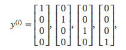

# Week 4 Lecture Notes

[TOC]

# ML:Neural Networks: Representation

## Overview

Addresses the problem when trying to build non-linear classification . 

With logistic regression we can build new features by considering non-linear terms. For example if we have 100 features, we can then build 5000 by going to the 2nd order polynomial.  

- 2nd order polynomial features: asymptotically the number of terms grows by $O(n^2/2)$
- 2nd order polynomial features: asymptotically the number of terms grows by $O(n^3/2)$

This has a few problems:

- It can cause over fit of the training set
- It gets computationally expensive 

**Why we need non-linear classification**

Example: identifying cars from images

Using 50x50 pixel images (2500 pixels) -> features $n=2500$ and $n=7500$ if *RGB*

We will then have 3 million ($2500^2/2$) **features** if we consider quadratic features. 

*Take away:* its not feasible to consider all these features and of higher dimension 

**Solution:** Neural Networks 

# Non-linear Hypotheses

Performing linear regression with a complex set of data with many features is very unwieldy. Say you wanted to create a hypothesis from three (3) features that included all the quadratic terms:
$$
\begin{align*}& g(\theta_0 + \theta_1x_1^2 + \theta_2x_1x_2 + \theta_3x_1x_3 \newline& + \theta_4x_2^2 + \theta_5x_2x_3 \newline& + \theta_6x_3^2 )\end{align*}
$$
That gives us 6 features. The exact way to calculate how many features for all polynomial terms is the combination function with repetition: [http://www.mathsisfun.com/combinatorics/combinations-permutations.html](http://www.mathsisfun.com/combinatorics/combinations-permutations.html)
$$
 \frac{(n+r−1)!}{r!(n−1)!} 
$$
In this case we are taking all *two-element combinations of three features*: $\frac{(3+2−1)!}{(2!⋅(3−1)!)} = \frac{4!}{4}=6$. (**Note**: you do not have to know these formulas, I just found it helpful for understanding).

For 100 features, if we wanted to make them quadratic we would get $\frac{(100+2−1)!}{(2⋅(100−1)!)}=5050$ resulting new features.

We can approximate the growth of the number of new features we get with all quadratic terms with $O(n^2/2)$. 

If you wanted to include all cubic terms in your hypothesis, the features would grow asymptotically at $O(n^3)$. These are very steep growths, so as the number of our features increase, the number of quadratic or cubic features increase very rapidly and becomes quickly impractical.

**Example**: let our training set be a collection of $50$ x $50$ pixel black-and-white photographs, and our goal will be to classify which ones are photos of cars. Our feature set size is then $n = 2500$ if we compare every pair of pixels.

Now let's say we need to make a quadratic hypothesis function. With quadratic features, our growth is $O(n^2/2)$. So our total features will be about $2500^2/2=3125000$, which is very impractical.

***Neural networks offers an alternate way to perform machine learning when we have complex hypotheses with many features.***
# Neurons and the Brain

Neural networks are limited imitations of how our own brains work. They've had a big recent resurgence because of advances in computer hardware.

There is evidence that the brain uses only ***one "learning algorithm"*** for all its different functions. Scientists have tried cutting (in an animal brain) the connection between the ears and the auditory cortex and rewiring the optical nerve with the auditory cortex to find that the auditory cortex literally learns to see.

This principle is called "neuroplasticity" and has many examples and experimental evidence.

At a very simple level, neurons are basically computational units that take input (**dendrites**) as electrical input (called "spikes") that are channeled to outputs (**axons**).

1. Dendrite - input wires
2. Computation in cell body 
3. Axon  - output coile  

### Artificial Neuron model: Logistic Unit

**Single Neuron**

The following is a representation of a *single neuron* 

Where the *hypothesis function* 
$$
h_\theta=\frac{1}{1+e^{-\theta^Tx}}
$$
In our model, our dendrites are like the input features $x_1⋯x_n$:
$$
x = \begin{bmatrix}x_0 \newline x_1 \newline x_2 \newline x_3 \newline \end{bmatrix}
$$
and our $\theta$ <u>parameters</u> **also called** ***Weights***
$$
\theta = \begin{bmatrix}\theta_0 \newline \theta_1 \newline \theta_2 \newline \theta_3 \newline \end{bmatrix}
$$
Recall that $x_0=1$; so it is sometimes omitted from diagrams. $x_0$ is also called the ***bias unit***

The <u>sigmoid (logistic function)</u> is also called the ***activation function***
$$
\frac{1}{1+e^{-\theta^Tx}}
$$

# Model Representation

Let's examine how we will represent a hypothesis function using neural networks.

Visually, a simplistic representation looks like:

Our input nodes (layer 1) go into another node (layer 2), and are output as the hypothesis function.

##### Terminology:

- Layer 1: Input layer
- Layer 2: Hidden layer
  - layer that isnt an input/output layer
  - the idea is that the input/output layers we can observe but the layers between we cant exactly see what happens
- Layer 3: Output layer

##### Notation

- $a_i^{(j)}$ = "activation" of unit $i$ in layer $j$ | **activation node**
  - *"activation"* -> value that is computed by and is output by a specific neuron
- $\Theta^{(j)}$ = **matrix of weights** controlling function mapping from layer $j$ to layer $j+1$

##### Method

This process to compute $h$ in the next two sections is also called *forward propagation* - we start with the activation of the input units and forward propagate it to the hidden layer etc. 

##### Node representation

The values for each of the "activation" nodes in layer 2 and 3 is obtained as follows:
$$
\begin{align*}
a_1^{(2)} = g(\Theta_{1,0}^{(1)}x_0 + \Theta_{1,1}^{(1)}x_1 + \Theta_{1,2}^{(1)}x_2 + \Theta_{1,3}^{(1)}x_3) \newline
a_2^{(2)} = g(\Theta_{2,0}^{(1)}x_0 + \Theta_{2,1}^{(1)}x_1 + \Theta_{2,2}^{(1)}x_2 + \Theta_{2,3}^{(1)}x_3) \newline
a_3^{(2)} = g(\Theta_{3,0}^{(1)}x_0 + \Theta_{3,1}^{(1)}x_1 + \Theta_{3,2}^{(1)}x_2 + \Theta_{3,3}^{(1)}x_3) \newline
h_\Theta(x) = a_1^{(3)} = g(\Theta_{1,0}^{(2)}a_0^{(2)} + \Theta_{1,1}^{(2)}a_1^{(2)} + \Theta_{1,2}^{(2)}a_2^{(2)} + \Theta_{1,3}^{(2)}a_3^{(2)}) \newline
\end{align*}
$$
In this case $\Theta^1\in R^{3\times4}$

We apply each row of the parameters to our inputs to obtain the value for one activation node. Our hypothesis output is the logistic function applied to the sum of the values of our activation nodes, which have been multiplied by yet another parameter matrix $Θ^{(2)}$ containing the weights for our second layer of nodes.

Each layer gets its own matrix of weights, $Θ^{(j)}$.

##### Dimension of weight matrix

$\text{If network has } s_j \text{units in layer } j \text{and } s_{j+1} \text{units in layer } j+1\text{, then }Θ^{(j)} \text{will be of dimension } s_{j+1}×(s_j+1)$

###### *Example:*

Example: layer 1 has 2 input nodes and layer 2 has 4 activation nodes. Dimension of $Θ^{(1)}$ is going to be $4×3$ where $s_j=2$ and $s_j+1=4$, so $s_j+1×(sj+1)=4×3$.

==NOTE== The hypothesis function for Neural Networks are parameterized by $\Theta$

#### Neural Network Vectorized Implantation - forward propagation

n this section we'll do a **vectorized implementation** of the above functions. We're going to define a new variable $z^{(j)}_k$ that encompasses the parameters inside our $g$ function.

$z^{(j)}_k =   \Theta_{k,0}^{(j-1)}x_0 + \Theta_{k,1}^{(j-1)}x_1 + \cdots + \Theta_{k,n}^{(j-1)}x_n$

our layer 1 nodes become:
$$
\begin{align*}a_1^{(2)} = g(z_1^{(2)}) \newline a_2^{(2)} = g(z_2^{(2)}) \newline a_3^{(2)} = g(z_3^{(2)}) \newline \end{align*}
$$
we can further vectorise by:

$z^{(2)} = \begin{bmatrix}z^2 \newline z^2 \newline z^2 \newline \end{bmatrix}$ and $a^{(1)}=x = \begin{bmatrix}x_0 \newline x_1 \newline x_2 \newline x_3 \newline \end{bmatrix}$

so then 
$$
z^{(2)}=\Theta^{(1)}x=\Theta^{(1)}a^{(1)} \\
a^{(2)}=g(z^{(2)})
$$
==NOTE== the sigmoid function $g$ is applied element wise onto $z^{(2)}$ 
in the above example: $a^{(2)}\in R^3$ and $z^{(2)} \in R^3$

Finally to compute the hypothesis value: 
$$
z^3=\Theta^2a^2 \\
h_\Theta(x) = a^3=g(z^3)
$$

#### Abstraction:

In other words, for layer j=2 and node k, the variable z will be:
$$

z_k^{(2)} = \Theta_{k,0}^{(1)}x_0 + \Theta_{k,1}^{(1)}x_1 + \cdots + \Theta_{k,n}^{(1)}x_n

$$
The vector representation of $x$ and $z^j$ is:
$$

\begin{align*}x = \begin{bmatrix}x_0 \newline x_1 \newline\cdots \newline x_n\end{bmatrix} & \text{ , }z^{(j)} = \begin{bmatrix}z_1^{(j)} \newline z_2^{(j)} \newline\cdots \newline z_n^{(j)}\end{bmatrix}\end{align*}

$$
Setting $x=a^{(1)}$ (for notation consistancy we set the inout x to be layer $a^{(1)}$), we can rewrite the equation as:
$$

z^{(j)} = \Theta^{(j-1)}a^{(j-1)}

$$
We are multiplying our matrix $Θ^{(j−1)}$ with dimensions $s_j×(n+1)$ (where $s_j$ is the number of our activation nodes) by our vector $a^{(j−1)}$ with height $(n+1)$. This gives us our vector $z^{(j)}$ with height $s_j$.

Now we can get a vector of our activation nodes for layer $j$ as follows:

$a^{(j)}=g(z^{(j)})$

Where our function g can be applied element-wise to our vector $z^{(j)}$.

We can then add a bias unit (equal to 1) to layer j after we have computed $a^{(j)}$. This will be element $a^{(j)}_0$ and will be equal to 1.

To compute our final hypothesis, let's first compute another $z$ vector:

$z^{(j+1)}=Θ^{(j)}a^{(j)}$

We get this final $z$ vector by multiplying the next theta matrix after $Θ^{(j−1)}$ with the values of all the activation nodes we just got.

This last theta matrix $Θ^{(j)}$ will have only **one row** so that our result is a single number.

We then get our final result with:

$h_Θ(x)=a^{(j+1)}=g(z^{(j+1)})$

Notice that in this **last step**, between layer $j$ and layer $j+1$, we are doing **exactly the same thing** as we did in logistic regression.

***Adding all these intermediate layers in neural networks allows us to more elegantly produce interesting and more complex non-linear hypotheses.***

**Summary**
$$
z^{(j)} = \Theta^{(j-1)}a^{(j-1)}\\
a^{(j)}=g(z^{(j)})\\
h_Θ(x)=a^{(j+1)}=g(z^{(j+1)})
$$

#### Architecture

- The way the NN is laid out 

*Example:*

# Intuition 

Lets say we have a NN where we can only see layer 2 and 3. Our hypothesis is essentially calculated as a regression problem using the inputs from layer 2. 

Rather then calculating the hypothesis value from the feature inputs $x$ , $h$ is calculated from the new features $a^{(2)}$ **WHERE** the features from $a^{(2)}$ are them selves learned as a function of the input.

**TAKE AWAY** you aren't constrained to use the original features or polynomial expressions of the features as you are with logistic regression because of the hidden layers compute new layers outside these constraints  through the $\Theta$ mapping!

# Examples and Intuitions I

A simple example of applying neural networks is by predicting $y=x_1$ AND $x_2$, which is the logical 'and' operator and is only true if both $x_1$ and $x_2$ are 1.

The graph of our functions will look like:

$$
\begin{align*}\begin{bmatrix}x_0 \newline x_1 \newline x_2\end{bmatrix} \rightarrow\begin{bmatrix}g(z^{(2)})\end{bmatrix} \rightarrow h_\Theta(x)\end{align*}
$$
Remember that $x_0$ is our bias variable and is always 1.

Let's set our first theta matrix as:
$$
\Theta^{(1)} =\begin{bmatrix}-30 & 20 & 20\end{bmatrix}
$$
This will cause the output of our hypothesis to only be positive if both $x_1$ and $x_2$ are 1. In other words:
$$
\begin{align*}& h_\Theta(x) = g(-30 + 20x_1 + 20x_2) \newline \newline & x_1 = 0 \ \ and \ \ x_2 = 0 \ \ then \ \ g(-30) \approx 0 \newline & x_1 = 0 \ \ and \ \ x_2 = 1 \ \ then \ \ g(-10) \approx 0 \newline & x_1 = 1 \ \ and \ \ x_2 = 0 \ \ then \ \ g(-10) \approx 0 \newline & x_1 = 1 \ \ and \ \ x_2 = 1 \ \ then \ \ g(10) \approx 1\end{align*}
$$

So we have constructed one of the fundamental operations in computers by using a small neural network rather than using an actual AND gate. Neural networks can also be used to simulate all the other logical gates.

# Examples and Intuitions II

The $Θ^{(1)}$ matrices for AND, NOR, and OR are:

$$
\begin{align*}AND:\newline\Theta^{(1)} &=\begin{bmatrix}-30 & 20 & 20\end{bmatrix} \newline 
NOR:\newline
\Theta^{(1)} &= \begin{bmatrix}10 & -20 & -20\end{bmatrix} \newline OR:
\newline
\Theta^{(1)} &= \begin{bmatrix}-10 & 20 & 20\end{bmatrix} \newline 
NOT: \newline
\Theta^{(1)}&=[10 -20]\end{align*}
$$

We can combine these to get the XNOR logical operator (which gives 1 if $x_1$ and $x_2$ are both 0 or both 1).

The $\text{XNOR}$ results look like:

 

$$
\begin{align*}\begin{bmatrix}x_0 \newline x_1 \newline x_2\end{bmatrix} \rightarrow\begin{bmatrix}a_1^{(2)} \newline a_2^{(2)} \end{bmatrix} \rightarrow\begin{bmatrix}a^{(3)}\end{bmatrix} \rightarrow h_\Theta(x)\end{align*}
$$
For the transition between the first and second layer, we'll use a $Θ^{(1)}$ matrix that combines the values for AND and NOR:
$$
\Theta^{(1)} =\begin{bmatrix}-30 & 20 & 20 \newline 10 & -20 & -20\end{bmatrix}
$$

For the transition between the second and third layer, we'll use a $Θ^{(2)}$ matrix that uses the value for OR:
$$
\Theta^{(2)} =\begin{bmatrix}-10 & 20 & 20\end{bmatrix}
$$

Let's write out the values for all our nodes:
$$
\begin{align*}& a^{(2)} = g(\Theta^{(1)} \cdot x) \newline& a^{(3)} = g(\Theta^{(2)} \cdot a^{(2)}) \newline& h_\Theta(x) = a^{(3)}\end{align*}
$$
And there we have the XNOR operator using two hidden layers!

# Multiclass Classification

To classify data into multiple classes, we let our hypothesis function return a vector of values. Say we wanted to classify our data into one of four final resulting classes:

$$
\begin{align*}\begin{bmatrix}x_0 \newline x_1 \newline x_2 \newline\cdots \newline x_n\end{bmatrix} \rightarrow\begin{bmatrix}a_0^{(2)} \newline a_1^{(2)} \newline a_2^{(2)} \newline\cdots\end{bmatrix} \rightarrow\begin{bmatrix}a_0^{(3)} \newline a_1^{(3)} \newline a_2^{(3)} \newline\cdots\end{bmatrix} \rightarrow \cdots \rightarrow\begin{bmatrix}h_\Theta(x)_1 \newline h_\Theta(x)_2 \newline h_\Theta(x)_3 \newline h_\Theta(x)_4 \newline\end{bmatrix} \rightarrow\end{align*}
$$
Our final layer of nodes, when multiplied by its theta matrix, will result in another vector, on which we will apply the $g()$ logistic function to get a vector of hypothesis values.

Our resulting hypothesis for one set of inputs may look like:
$$
h_\Theta(x) =\begin{bmatrix}0 \newline 0 \newline 1 \newline 0 \newline\end{bmatrix}
$$
In which case our resulting class is the third one down, or $h_Θ(x)_3$.

We can define our set of resulting classes as $y$:

Our final value of our hypothesis for a set of inputs will be one of the elements in y

