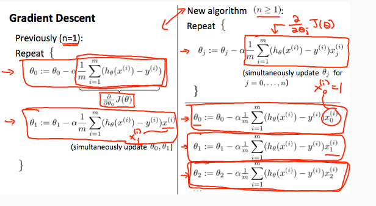
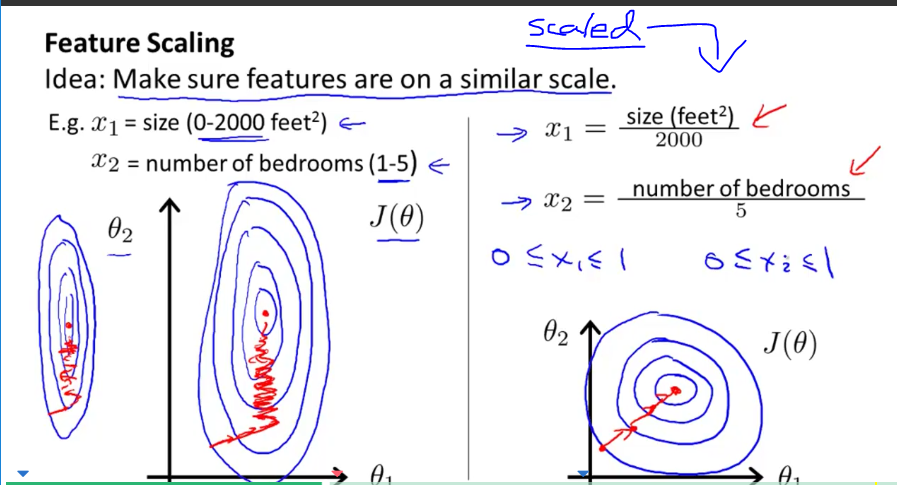
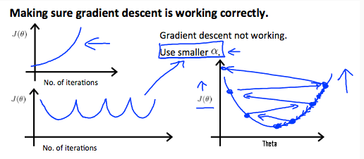
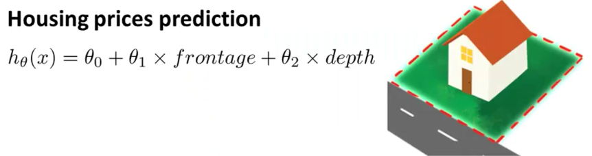
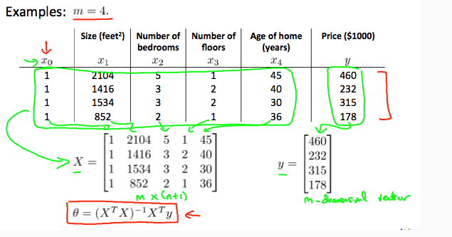
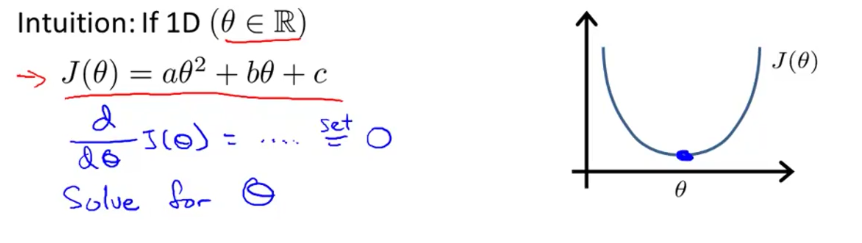
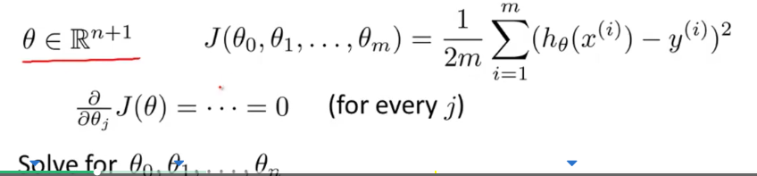

# Week 2

[TOC]

# Multivariate Linear Regression

Linear regression with multiple variables is also known as "multivariate linear regression".

We now introduce notation for equations where we can have any number of input variables.
$$
\begin{align*}x_j^{(i)} &= \text{value of feature } j \text{ in the }i^{th}\text{ training example} \newline x^{(i)}& = \text{the column vector of all the feature inputs of the }i^{th}\text{ training example} \newline m &= \text{the number of training examples} \newline n &= \left| x^{(i)} \right| ; \text{(the number of features)} \end{align*}
$$
Now define the multivariable form of the hypothesis function as follows, accommodating these multiple features:
$$
h_\theta (x) = \theta_0 + \theta_1 x_1 + \theta_2 x_2 + \theta_3 x_3 + \cdots + \theta_n x_n
$$
In order to develop intuition about this function, we can think about $θ_0$ as the basic price of a house, $θ_1$ as the price per square meter, $θ_2$ as the price per floor, etc. $x_1$ will be the number of square meters in the house, $x_2$ the number of floors, etc.

Using the definition of matrix multiplication, our multivariable hypothesis function can be concisely represented as:
$$
\begin{align*}h_\theta(x) =\begin{bmatrix}\theta_0 \hspace{2em}  \theta_1 \hspace{2em}  ...  \hspace{2em}  \theta_n\end{bmatrix}\begin{bmatrix}x_0 \newline x_1 \newline \vdots \newline x_n\end{bmatrix}= \theta^T x\end{align*}
$$
This is a vectorization of our hypothesis function for one training example; see the lessons on vectorization to learn more.

Remark: Note that for convenience reasons in this course Mr. Ng assumes $x_0(i)=1$ for $(i∈1,…,m)$

[**Note**: So that we can do matrix operations with theta and x, we will set $x^{(i)}_0 = 1$, for all values of $i$. This makes the two vectors $\theta$ and $x_{(i)}$ match each other element-wise (that is, have the same number of elements: n+1).]

The training examples are stored in X row-wise, like such:
$$
\begin{align*}X = \begin{bmatrix}x^{(1)}_0 & x^{(1)}_1  \newline x^{(2)}_0 & x^{(2)}_1  \newline x^{(3)}_0 & x^{(3)}_1 \end{bmatrix}&,\theta = \begin{bmatrix}\theta_0 \newline \theta_1 \newline\end{bmatrix}\end{align*}
$$
You can calculate the hypothesis as a column vector of size (m x 1) with:

$h_θ(X)=Xθ$

**For the rest of these notes, and other lecture notes, X will represent a matrix of training examples **$x(i)$ **stored row-wise.**

## **Cost function**

For the parameter vector θ (of type $R^{n+1}$ or in $R^{(n+1)×1}$, the cost function is:

$J(\theta) = \dfrac {1}{2m} \displaystyle \sum_{i=1}^m \left (h_\theta (x^{(i)}) - y^{(i)} \right)^2$

The vectorized version is:

$J(\theta) = \dfrac {1}{2m} (X\theta - \vec{y})^{T} (X\theta - \vec{y})$

Where $\vec{y}$  denotes the vector of all y values.

## **Gradient Descent for Multiple Variables**

The gradient descent equation itself is generally the same form; we just have to repeat it for our 'n' features:
$$
\begin{align*}
& \text{repeat until convergence:} \; \lbrace \newline 
\; & \theta_0 := \theta_0 - \alpha \frac{1}{m} \sum\limits_{i=1}^{m} (h_\theta(x^{(i)}) - y^{(i)}) \cdot x_0^{(i)}\newline
\; & \theta_1 := \theta_1 - \alpha \frac{1}{m} \sum\limits_{i=1}^{m} (h_\theta(x^{(i)}) - y^{(i)}) \cdot x_1^{(i)} \newline
\; & \theta_2 := \theta_2 - \alpha \frac{1}{m} \sum\limits_{i=1}^{m} (h_\theta(x^{(i)}) - y^{(i)}) \cdot x_2^{(i)} \newline
& \cdots
\newline \rbrace
\end{align*}
$$
In other words:
$$
\begin{align*}& \text{repeat until convergence:} \; \lbrace \newline \; & \theta_j := \theta_j - \alpha \frac{1}{m} \sum\limits_{i=1}^{m} (h_\theta(x^{(i)}) - y^{(i)}) \cdot x_j^{(i)} \;  & \text{for j := 0..n}\newline \rbrace\end{align*}
$$

## Matrix Notation

The Gradient Descent rule can be expressed as:

$θ:=θ−α∇J(θ)$

Where $∇J(θ)$ is a column vector of the form:
$$
\nabla J(\theta)  = \begin{bmatrix}\frac{\partial J(\theta)}{\partial \theta_0}   \newline \frac{\partial J(\theta)}{\partial \theta_1}   \newline \vdots   \newline \frac{\partial J(\theta)}{\partial \theta_n} \end{bmatrix}
$$
The j-th component of the gradient is the summation of the product of two terms:
$$
\begin{align*}
\; &\frac{\partial J(\theta)}{\partial \theta_j} &=&  \frac{1}{m} \sum\limits_{i=1}^{m}  \left(h_\theta(x^{(i)}) - y^{(i)} \right) \cdot x_j^{(i)} \newline
\; & &=& \frac{1}{m} \sum\limits_{i=1}^{m}   x_j^{(i)} \cdot \left(h_\theta(x^{(i)}) - y^{(i)}  \right) 
\end{align*}
$$
Sometimes, the summation of the product of two terms can be expressed as the product of two vectors.

Here, $x^{(i)}_j$ for $i = 1,...,m$, represents the m elements of the j-th column, $\vec{x}_j$ , of the training set X.

The other term $(h_θ(x^{(i)})−y^{(i)})$ is the vector of the deviations between the predictions $h_θ(x(i))$ and the true values $y^{(i)}$. Re-writing $\frac{∂J(θ)}{∂θj}$, we have:
$$
\begin{align*}\; &\frac{\partial J(\theta)}{\partial \theta_j} &=& \frac1m  \vec{x_j}^{T} (X\theta - \vec{y}) \newline\newline\newline\; &\nabla J(\theta) & = & \frac 1m X^{T} (X\theta - \vec{y}) \newline\end{align*}
$$
Finally, the matrix notation (vectorized) of the Gradient Descent rule is:
$$
\theta := \theta - \frac{\alpha}{m} X^{T} (X\theta - \vec{y})
$$


## ***Algorithm:*** Gradient Descent

*Repeat until convergence:*
$$
\theta_j := \theta_j - \alpha \frac{1}{m} \sum\limits_{i=1}^{m} (h_\theta(x^{(i)}) - y^{(i)}) \cdot x_j^{(i)} \;  \text{for j := 0...n}
$$
**Context of gradient descent w.r.t. n=1**



==Note== $x^i_0 = 1$ and the partial derivative of the cost function for $n \geq 1$

## Feature Normalization - Speeding up Gradient Descent 

We can speed up our algorithm by having our input values in roughly the same ranges. $\theta$ will descent quickly on small ranges and slowly on large ranges. i.e oscillation occurs on the uneven surface. 

Two techniques to help with this are **feature scaling** and **mean normalization**. Feature scaling involves dividing the input values by the range (i.e. the maximum value minus the minimum value) of the input variable, resulting in a new range of just 1. *Mean normalization* involves subtracting the average value for an input variable from the values for that input variable, resulting in a new average value for the input variable of just zero. 

### Feature Scaling

> Make sure features are on a **similar scale**
>
> Get every feature into approximately a $a\leq x_i \leq b$ range

*Naïve Method:* 
$$
x_i := \frac{x_i}{\text{max}(x_i)}
$$


### Mean Normalization 

> Replace $x_i$ with $x_i - \mu_i$ to make features have approximately **zero mean**

==NOTE== do not apply to $x_0=1$

*Method:* - This method will normalize and feature scale.
$$
x_i := \dfrac{x_i - \mu_i}{s_i} \\
\mu_i - \text{average of all values of feature i}\\
s_i - \text{range of values (min-max) or its the standard deviation}
$$
==NOTE== The quizzes in this course use range - the programming exercises use standard deviation.

## Learning Rate & Debugging 

* If $\alpha$ is to small: slow convergence
* If $\alpha$ is to large: $J(\theta)$ may not decrease on every iteration; may not converge

### Debugging gradient descent. 

Make a plot with *number of iterations* on the x-axis. Now plot the cost function, J(θ) over the number of iterations of gradient descent. If J(θ) ever increases, then you probably need to decrease α.

### Automatic convergence test. 

Declare convergence if J(θ) decreases by less than E in one iteration, where E is some small value such as $10^{−3}$. However in practice it's difficult to choose this threshold value.

### *Example 1:* Different Learning Rates


The learning rates: $\alpha_B << \alpha_A << \alpha_C$

In graph C, the cost function is increasing- the learning rate is to high.
Graph A,B converge to an optimum of the cost function, but graph B does so much slower due to how small $\alpha$ is.

### *Example 2:* Oscillation

Observe what the cost function plot looks like when overshooting occurs:



## ***Vectorized:*** Gradient Descent 

$$
\theta := \theta - \frac{\alpha}{m} X^{T} (X\theta - \vec{y})
$$

### Derivation


The Gradient Descent rule can be expressed as:

$θ:=θ−α∇J(θ)$

Where $∇J(θ)$ is a column vector of the form:
$$
\nabla J(\theta)  = \begin{bmatrix}\frac{\partial J(\theta)}{\partial \theta_0}   \newline \frac{\partial J(\theta)}{\partial \theta_1}   \newline \vdots   \newline \frac{\partial J(\theta)}{\partial \theta_n} \end{bmatrix}
$$
The j-th component of the gradient is the summation of the product of two terms:
$$
\begin{align*}
\; &\frac{\partial J(\theta)}{\partial \theta_j} &=&  \frac{1}{m} \sum\limits_{i=1}^{m}  \left(h_\theta(x^{(i)}) - y^{(i)} \right) \cdot x_j^{(i)} \newline
\; & &=& \frac{1}{m} \sum\limits_{i=1}^{m}   x_j^{(i)} \cdot \left(h_\theta(x^{(i)}) - y^{(i)}  \right) 
\end{align*}
$$
Sometimes, the summation of the product of two terms can be expressed as the product of two vectors.

Here, $x^{(i)}_j$ for $i = 1,...,m$, represents the m elements of the j-th column, $\vec{x}_j$ , of the training set X.

The other term $(h_θ(x^{(i)})−y^{(i)})$ is the vector of the deviations between the predictions $h_θ(x(i))$ and the true values $y^{(i)}$. Re-writing $\frac{∂J(θ)}{∂θj}$, we have:
$$
\begin{align*}\; &\frac{\partial J(\theta)}{\partial \theta_j} &=& \frac1m  \vec{x_j}^{T} (X\theta - \vec{y}) \newline\newline\newline\; &\nabla J(\theta) & = & \frac 1m X^{T} (X\theta - \vec{y}) \newline\end{align*}
$$
Finally, the matrix notation (vectorized) of the Gradient Descent rule is:
$$
\theta := \theta - \frac{\alpha}{m} X^{T} (X\theta - \vec{y})
$$


# Features

We can **combine** multiple features into one. 

***For example:***

We can combine $x_1$ and $x_2$ into a new feature $x_3 = x_1 x_2$ i.e frontage x depth, no need for two separate parameters. 



# Polynomial Regression

> We can **change the behavior or curve** of our hypothesis function by making it a quadratic, cubic or square root function (or any other form).

If our hypothesis functions is $h_\theta(x) = \theta_0 + \theta_1 x_1$, we can create additional features based on $x_1$.

$h_\theta(x) = \theta_0 + \theta_1 x_1 + \theta_2 x_1^2$

$h_\theta(x) = \theta_0 + \theta_1 x_1 + \theta_2 x_1^2 + \theta_3 x_1^3$

$h_\theta(x) = \theta_0 + \theta_1 x_1 + \theta_2 \sqrt{x_1}$

==NOTE== Scaling becomes very important when dealing with polynomials terms 

eg if $x_1$ has range 1 - 1000 then range of $x^2_1$ becomes 1 - 1000000 and that of $x^3_1$ becomes 1 - 1000000000

==NOTE:== We will look algorithms later that can determine what kind of polynomial to use

# ***Normal Equation*** - Computing Parameters Analytically

> Method for solving for $\theta$ analytically 

==NOTE== Feature scaling is not needed

### ***Formula:*** Normal Equation 

$$
\theta = (X^T X)^{-1}X^T y
$$

Where $\theta$ is a vector containing the parameter values

### **Terminology:** 

* $X$ - design matrix

## Example:



## Octave Code

```octave
pinv(x'*x)*x'*y
```

## Intuition

Here we consider the **1D** case. essentially we find the 1st derivative of the cost function and equate it to zero - as is done to find the optimal solution of the curve. 



$n$ dimensional extension



## Pros & Cons

| Gradient Descent             | Normal Equation                          |
| ---------------------------- | ---------------------------------------- |
| Need to choose alpha         | No need to choose alpha                  |
| Needs many iterations        | No need to iterate                       |
| $O (kn^2)$                   | $O (n^3)$, need to calculate inverse of $X^TX$ |
| Works well when $n$ is large | Slow if $n$ is very large                |

With the normal equation, computing the inversion has complexity O(n3). So if we have a very large number of features, the normal equation will be slow. In practice, when n exceeds 10,000 it might be a good time to go from a normal solution to an iterative process.

## Recap:

Matrix identity 


## Non-Inevitability

> What if $X^TX$ is non-invertible?

==NOTE== Octave already considers this situation with `pinv` 

## Common Causes

- Redundant features, where two features are very closely related (i.e. they are linearly dependent)
- Too many features (e.g. m ≤ n). In this case, delete some features or use "regularization" (to be explained in a later lesson).

Solutions to the above problems include deleting a feature that is linearly dependent with another or deleting one or more features when there are too many features.