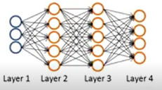
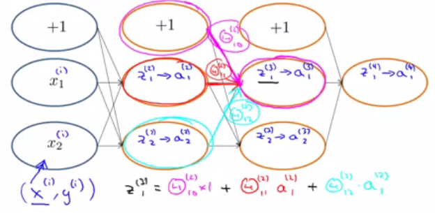
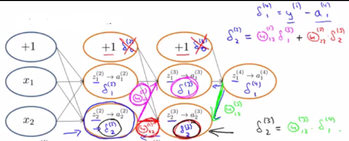
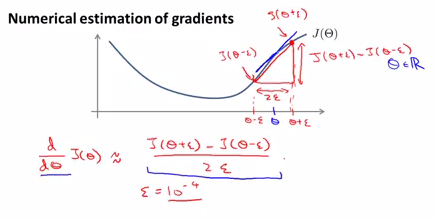
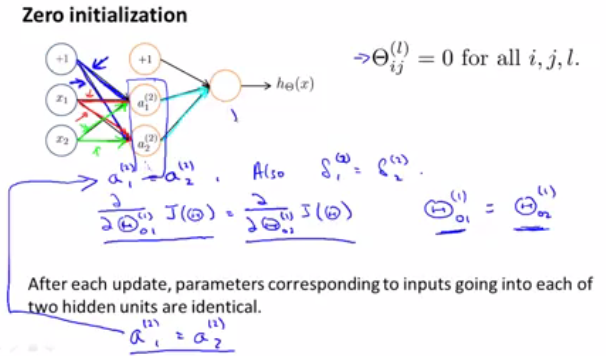

# Week 5 Lecture Notes

[TOC]

# ML:Neural Networks: Learning

# Cost Function

#### Notation

a) $L$= total number of layers in the network

b) $s_l$ = number of units (not counting bias unit) in layer l

c) $K$= number of output units/classes

#### Types of classification

| Binary classification | **Multi-class classification**  |
| --------------------- | ------------------------------- |
| $y=0$ or $y=1$        | $y\in R^K$                      |
| *One output unit*     | *k output units* where $k\geq3$ |
| $h_\Theta(x)\in R$    | $h_\Theta \in R^K$              |
|                       |                                 |

****

Multi-class E.g. 

$$
\begin{bmatrix}1 \newline 0 \newline 0 \newline 0\end{bmatrix} \text{pedestrian}
,\begin{bmatrix}0 \newline 1 \newline 0 \newline 0\end{bmatrix} \text{car},
\begin{bmatrix}0 \newline 0 \newline 1 \newline 0\end{bmatrix} \text{truck},
\begin{bmatrix}0 \newline 0 \newline 0 \newline 1\end{bmatrix} \text{bike}
$$
Recall that in neural networks, we may have many output nodes. We denote $h_Θ(x)_k$ as being a **hypothesis** that results in the $k^{th}$ output.

**Our cost function for neural networks is going to be a generalization of the one we used for logistic regression.**

Recall that the <u>cost function for regularized logistic regression</u> was:
$$
J(\theta) = - \frac{1}{m} \sum_{i=1}^m \large[ y^{(i)}\ \log (h_\theta (x^{(i)})) + (1 - y^{(i)})\ \log (1 - h_\theta(x^{(i)}))\large] + \frac{\lambda}{2m}\sum_{j=1}^n \theta_j^2
$$
##### Cost function for NN

The cost function for neural networks, it is going to be slightly more complicated:
$$
\begin{gather*}\large J(\Theta) = - \frac{1}{m} \sum_{i=1}^m \sum_{k=1}^K \left[y^{(i)}_k \log ((h_\Theta (x^{(i)}))_k) + (1 - y^{(i)}_k)\log (1 - (h_\Theta(x^{(i)}))_k)\right] + \frac{\lambda}{2m}\sum_{l=1}^{L-1} \sum_{i=1}^{s_l} \sum_{j=1}^{s_{l+1}} ( \Theta_{j,i}^{(l)})^2\end{gather*}
$$
We have added a few nested summations to account for our multiple output nodes. 

*In the first part of the equation*, between the square brackets, we have an additional nested summation that <u>loops through the number of output nodes.</u>

*In the regularization part*, after the square brackets, we must account for multiple theta matrices. 

i.e. loop through every $\theta$ in each $\Theta$ in every layer

The number of columns in our current theta matrix is equal to the number of nodes in our current layer (including the bias unit). 

The number of rows in our current theta matrix is equal to the number of nodes in the next layer (excluding the bias unit). 

As before with logistic regression, we square every term.

#### Note:

- the double sum simply adds up the logistic regression costs calculated for each cell in the output layer; and
- the triple sum simply adds up the squares of all the individual Θs in the entire network.
- the i in the triple sum does **not** refer to training example i
- Note that the regularization summation ignores the bias values where $i=0$

# Backpropagation Algorithm

"Backpropagation" is neural-network terminology for minimizing our cost function, just like what we were doing with gradient descent in logistic and linear regression.

##### **Our goal is to compute:**

$min_ΘJ(Θ)$

We want to minimize our cost function J using an optimal set of parameters in theta. 

To do this we must define:

* $J(Θ)$ 
* $\frac{∂}{∂Θ^{(l)}_{i,j}} J(Θ)$

We can compute the gradient using ***backpropagation algorithm***:

**Intuition:**
$$
δ^{(l)}_j = \text{"error" of node } j \text{ in layer }l
$$
Recall that $a^{(l)}_j$ is activation node j in layer l.



For the **last layer**, we can compute the vector of delta values with:

$δ^{(L)}=a^{(L)}−y$

Where L is our total number of layers and $a^{(L)}$ is the vector of outputs of the activation units for the last layer. 

So our "error values" for the last layer are simply the differences of our actual results in the last layer and the correct outputs in y.

To get the **delta values of the layers before the last layer**, we can use an equation that steps us back from right to left:
$$
\delta^{(l)} = ((\Theta^{(l)})^T \delta^{(l+1)})\ .*\ g'(z^{(l)}) \\
l \neq 1\text{ we dont calculate the delta error for the input layer}
$$
The delta values of layer $l$ are calculated by multiplying the delta values in the next layer with the theta matrix of layer $l$. We then element-wise multiply that with a function called g', or g-prime, which is the derivative of the activation function g evaluated with the input values given by $z^{(l)}$.

The g-prime derivative terms can also be written out as:
$$
g'(z^{(l)}) = a^{(l)}\ .*\ (1 - a^{(l)})
$$
This can be shown and proved in calculus.
$$
g(z) = \frac{1}{1 + e^{-z}}
$$

$$
\frac{\partial g(z)}{\partial z} = -\left( \frac{1}{1 + e^{-z}} \right)^2\frac{\partial{}}{\partial{z}} \left(1 + e^{-z} \right)
$$

##### The Back Propagation Equation for the inner nodes is then:

$$
\delta^{(l)} = ((\Theta^{(l)})^T \delta^{(l+1)})\ .*\ a^{(l)}\ .*\ (1 - a^{(l)})
$$
We can compute our partial derivative terms by multiplying our activation values and our error values for each training example t:
$$
\dfrac{\partial J(\Theta)}{\partial \Theta_{i,j}^{(l)}} = \frac{1}{m}\sum_{t=1}^m a_j^{(t)(l)} {\delta}_i^{(t)(l+1)}
$$
**NOTE**:  This ignores regularization, which we'll deal with later.

**Note:** $δ^{l+1}$ and $a^{l+1}$ are vectors with $s_{l+1}$ elements. Similarly,  $a^{(l)}$ is a vector with $s_l$ elements. Multiplying them produces a matrix that is $s_{l+1}$ by $s_l$ which is the same dimension as $Θ_{(l)}$. That is, the process produces a gradient term for every element in $Θ^{(l)}$. (Actually, $Θ^{(l)}$ has $s_l + 1$ column, so the dimensionality is not exactly the same).

We can now take all these equations and put them together into a backpropagation algorithm:

##### **Back propagation Algorithm**

Given training set $\lbrace (x^{(1)}, y^{(1)}) \cdots (x^{(m)}, y^{(m)})\rbrace$

- Set $Δ^{(l)}_{i,j} := 0$ for all $(l,i,j)$

For training example $t =1$ to $m$:

- Set $a^{(1)}:=x^{(t)}$
- Perform forward propagation to compute $a^{(l)}$ for $l=2,3,…,L$
- Using $y^{(t)}$, compute $δ^{(L)}=a^{(L)}−y^{(t)}$
- Compute $\delta^{(L-1)}, \delta^{(L-2)},\dots,\delta^{(2)}$ using $\delta^{(l)} = ((\Theta^{(l)})^T \delta^{(l+1)})\ .*\ a^{(l)}\ .*\ (1 - a^{(l)})$
- $\Delta^{(l)}_{i,j} := \Delta^{(l)}_{i,j} + a_j^{(l)} \delta_i^{(l+1)}$ or with vectorization, $\Delta^{(l)} := \Delta^{(l)} + \delta^{(l+1)}(a^{(l)})^T$
- $D^{(l)}_{i,j} := \dfrac{1}{m}\left(\Delta^{(l)}_{i,j} + \lambda\Theta^{(l)}_{i,j}\right)$ If $j≠0$ 
- $D^{(l)}_{i,j} := \dfrac{1}{m}\Delta^{(l)}_{i,j}$

$\Delta$ matrix is used as an ***"accumulator"*** to add up our values as we go along and eventually compute our partial derivative.

The $D^{(l)}_{i,j}$ terms are the ***partial derivatives*** and the results we are looking for:

$D_{i,j}^{(l)} = \dfrac{\partial J(\Theta)}{\partial \Theta_{i,j}^{(l)}}$.

# Backpropagation Intuition

Recall: Forward Propagation



Backpropagation does something very similar to forward propagation, but the computations flow from the right to the left

To understand backpropagation better, first consider he cost function:
$$
\begin{gather*}J(\theta) = - \frac{1}{m} \sum_{t=1}^m\sum_{k=1}^K  \left[ y^{(t)}_k \ \log (h_\theta (x^{(t)}))_k + (1 - y^{(t)}_k)\ \log (1 - h_\theta(x^{(t)})_k)\right] + \frac{\lambda}{2m}\sum_{l=1}^{L-1} \sum_{i=1}^{s_l} \sum_{j=1}^{s_l+1} ( \theta_{j,i}^{(l)})^2\end{gather*}
$$
If we consider simple non-multiclass classification (k = 1) and disregard regularization ($\lambda=0$)

The cost is computed with:
$$
cost(t) =y^{(t)} \ \log (h_\theta (x^{(t)})) + (1 - y^{(t)})\ \log (1 - h_\theta(x^{(t)}))
$$
More intuitively you can think of that equation roughly being a *squared error*:
$$
cost(t) \approx (h_\theta(x^{(t)})-y^{(t)})^2
$$
Intuitively, $δ^{(l)}_j$ = the "error" for $a^{(l)}_j$ (unit $j$ in layer $l$)

More formally, the delta values are actually the *derivative of the cost function with respect to the weighted sum of inputs*
$$
\delta_j^{(l)} = \dfrac{\partial}{\partial z_j^{(l)}} cost(t)
$$
Recall that our derivative is the slope of a line tangent to the cost function, *so the steeper the slope the more incorrect we are.*

**Back Propagation Illustration:**



We start at the output unit and look at the difference between the actual output $y$ and the activation $a^{(4)}$.

Then we propagate the error to the layer below using the weight $\Theta^{(3)}$  . Once the error has been calculated for $l=3$ we can back propagate the error to find the next set of $\delta$ in layer 2 

The $\delta$ values can be thought of as gradient of a line tangent to the cost function. i.e. 
$$
\delta^{(l)}_j \approx 0 \Leftrightarrow \text{no error of cost for } a^{(l)}_j 
$$
Note: The $\delta$ values of the bias units arent used.

# Implementation Note: Unrolling Parameters

With neural networks, we are working with sets of matrices:

$$
\begin{align*}
\Theta^{(1)}, \Theta^{(2)}, \Theta^{(3)}, \dots \newline
D^{(1)}, D^{(2)}, D^{(3)}, \dots
\end{align*}
$$
In order to use optimizing functions such as `fminunc()`, we will want to "unroll" all the elements and put them into one long vector:

```
thetaVector = [ Theta1(:); Theta2(:); Theta3(:); ]
deltaVector = [ D1(:); D2(:); D3(:) ]
```

If the dimensions of Theta1 is 10x11, Theta2 is 10x11 and Theta3 is 1x11, then we can get back our original matrices from the "unrolled" versions as follows:

```
Theta1 = reshape(thetaVector(1:110),10,11)
Theta2 = reshape(thetaVector(111:220),10,11)
Theta3 = reshape(thetaVector(221:231),1,11)
```

NOTE: The lecture slides show an example neural network with 3 layers. However, *3*theta matrices are defined: Theta1, Theta2, Theta3. There should be only 2 theta matrices: Theta1 (10 x 11), Theta2 (1 x 11).

```octave
% Learning Algo
% Init theta1,theta2,theta3
% unroll to get initTheta

fminunc(@costFunction,initialTheta,options)

function [jval,gradientVec] = costFuntion(thetaVec)
	% for thetaVec, get by reshape theta1,theta2,theta3
	% Forward/back prop to compute D1,D2,D3 and J
	% unroll D1,D2,D3 tp get gradientVec
```


# Gradient Checking

Gradient checking will assure that our backpropagation works as intended.

**We do this by using Numerical Gradient Checking**



We can approximate the derivative of our cost function with:
$$
\dfrac{\partial}{\partial\Theta}J(\Theta) \approx \dfrac{J(\Theta + \epsilon) - J(\Theta - \epsilon)}{2\epsilon}
$$
With multiple theta matrices, we can approximate the derivative **with respect to** $Θ_j$ as follows:

$$
\dfrac{\partial}{\partial\Theta_j}J(\Theta) \approx \dfrac{J(\Theta_1, \dots, \Theta_j + \epsilon, \dots, \Theta_n) - J(\Theta_1, \dots, \Theta_j - \epsilon, \dots, \Theta_n)}{2\epsilon}
$$
A good small value for ϵ (epsilon), guarantees the math above to become true. If the value be much smaller, may we will end up with numerical problems. The professor Andrew usually uses the value $ϵ=10^{−4}​$.

We are only adding or subtracting epsilon to the $Theta_j$ matrix. In octave we can do it as follows:

```
epsilon = 1e-4;
for i = 1:n,
  thetaPlus = theta;
  thetaPlus(i) += epsilon;
  thetaMinus = theta;
  thetaMinus(i) -= epsilon;
  gradApprox(i) = (J(thetaPlus) - J(thetaMinus))/(2*epsilon)
end;
```

We then want to check that $\text{gradApprox} ≈ \text{deltaVector}$.

Once you've verified **once** that your backpropagation algorithm is correct, then you don't need to compute gradApprox again. The code to compute gradApprox is very slow.

# Random Initialization - ***Symmetry Breaking***

Initializing all theta weights to zero does not work with neural networks.

When we backpropagate, all nodes will update to the same value repeatedly.



##### Solution: ***Symmetry Breaking***

Instead we can randomly initialize our weights:

Initialize each $Θ^{(l)}_{ij}$ to a random value between $[−ϵ,ϵ]$:

$$
\epsilon = \dfrac{\sqrt{6}}{\sqrt{\mathrm{Loutput} + \mathrm{Linput}}}
$$

$$
\Theta^{(l)} =  2 \epsilon * \mathrm{rand}(\text{L-output}, \text{L-input} + 1)    - \epsilon
$$

```
If the dimensions of Theta1 is 10x11, Theta2 is 10x11 and Theta3 is 1x11.

Theta1 = rand(10,11) * (2 * INIT_EPSILON) - INIT_EPSILON;
Theta2 = rand(10,11) * (2 * INIT_EPSILON) - INIT_EPSILON;
Theta3 = rand(1,11) * (2 * INIT_EPSILON) - INIT_EPSILON;
```

`rand(x,y)`will initialize a matrix of random real numbers between 0 and 1. (Note: this epsilon is unrelated to the epsilon from Gradient Checking)

Why use this method? This paper may be useful: [https://web.stanford.edu/class/ee373b/nninitialization.pdf](https://web.stanford.edu/class/ee373b/nninitialization.pdf)

# Putting it Together

First, pick a network architecture; choose the layout of your neural network, including how many hidden units in each layer and how many layers total.

- Number of input units = dimension of features $x^{(i)}$
- Number of output units = number of classes
- Number of hidden units per layer = usually more the better (must balance with cost of computation as it increases with more hidden units)
- Defaults: 1 hidden layer. If more than 1 hidden layer, then the same number of units in every hidden layer.

**Training a Neural Network**

1. Randomly initialize the weights
2. Implement forward propagation to get $h_θ(x^{(i)})$
3. Implement the cost function
4. Implement backpropagation to compute partial derivatives
5. Use gradient checking to confirm that your backpropagation works. Then disable gradient checking.
6. Use gradient descent or a built-in optimization function to minimize the cost function with the weights in theta.

When we perform forward and back propagation, we loop on every training example:

```
for i = 1:m,
   Perform forward propagation and backpropagation using example (x(i),y(i))
   (Get activations a(l) and delta terms d(l) for l = 2,...,L
```


# Explanation of Derivatives Used in Backpropagation

- We know that for a logistic regression classifier {(which is what all of the output neurons in a neural network are)}, we use the cost function, $J{(θ)}=−y\log{(h_θ{(x)})}−{(1−y)}log{(1−h_θ{(x)})}$, and apply this over the K output neurons, and for all m examples.
- The equation to compute the partial derivatives of the theta terms in the output neurons:
- $\frac{\partial J(\theta)}{\partial \theta^{(L-1)}} = \frac{\partial J(\theta)}{\partial a^{(L)}} \frac{\partial a^{(L)}}{\partial z^{(L)}} \frac{\partial z^{(L)}}{\partial \theta^{(L-1)}}$
- And the  equation to compute partial derivatives of the theta terms in the [last] hidden layer neurons {(layer L-1)}:
- $\frac{\partial J(\theta)}{\partial \theta^{(L-2)}} = \frac{\partial J(\theta)}{\partial a^{(L)}} \frac{\partial a^{(L)}}{\partial z^{(L)}} \frac{\partial z^{(L)}}{\partial a^{(L-1)}} \frac{\partial a^{(L-1)}}{\partial z^{(L-1)}} \frac{\partial z^{(L-1)}}{\partial \theta^{(L-2)}}$
- Clearly they share some pieces in common, so a delta term {(δ{(L)})} can be used for the common pieces between the output layer and the hidden layer immediately before it {(with the possibility that there could be many hidden layers if we wanted)}:
- $\delta^{(L)} = \frac{\partial J(\theta)}{\partial a^{(L)}} \frac{\partial a^{(L)}}{\partial z^{(L)}}$
- And we can go ahead and use another delta term ${(δ^{(L−1)})}$ for the pieces that would be shared by the final hidden layer and a hidden layer before that, if we had one. Regardless, this delta term will still serve to make the math and implementation more concise.
- $\delta^{(L-1)} = \frac{\partial J(\theta)}{\partial a^{(L)}} \frac{\partial a^{(L)}}{\partial z^{(L)}} \frac{\partial z^{(L)}}{\partial a^{(L-1)}} \frac{\partial a^{(L-1)}}{\partial z^{(L-1)}}$
- $\delta^{(L-1)} = \delta^{(L)} \frac{\partial z^{(L)}}{\partial a^{(L-1)}} \frac{\partial a^{(L-1)}}{\partial z^{(L-1)}}$
- With these delta terms, our equations become:
- $\frac{\partial J(\theta)}{\partial \theta^{(L-1)}} = \delta^{(L)} \frac{\partial z^{(L)}}{\partial \theta^{(L-1)}}$
- $\frac{\partial J(\theta)}{\partial \theta^{(L-2)}} = \delta^{(L-1)} \frac{\partial z^{(L-1)}}{\partial \theta^{(L-2)}}$
- Now, time to evaluate these derivatives:
- Let's start with the output layer:
- $\frac{\partial J(\theta)}{\partial \theta^{(L-1)}} = \delta^{(L)} \frac{\partial z^{(L)}}{\partial \theta^{(L-1)}}$
- Using $\delta^{(L)} = \frac{\partial J(\theta)}{\partial a^{(L)}} \frac{\partial a^{(L)}}{\partial z^{(L)}}$, we need to evaluate both partial derivatives.
- Given$J(\theta) = -ylog(a^{(L)}) - (1-y)log(1-a^{(L)})$, where $a^{(L)}=h_θ{(x)}$, the partial derivative is:
- $\frac{\partial J(\theta)}{\partial a^{(L)}} = \frac{1-y}{1-a^{(L)}} - \frac{y}{a^{(L)}}$
- And given $a=g{(z)}$, where $g= \frac{1}{1+e^{−z}}$, the partial derivative is:
- $\delta^{(L)} = \frac{\partial J(\theta)}{\partial a^{(L)}} \frac{\partial a^{(L)}}{\partial z^{(L)}}$
- So, let's substitute these in for $δ^{(L)}$:

$\delta^{(L)} = \frac{\partial J(\theta)}{\partial a^{(L)}} \frac{\partial a^{(L)}}{\partial z^{(L)}}$

$δ^{(L)}={(\frac{1−y}{1−a^{(L)}}−\frac{y}{a{(L)})}}{(a^{(L)}{(1−a^{(L)})})}$

$δ^{(L)}=a^{(L)}−y$

- So, for a 3-layer network {(L=3)},

δ{(3)}=a{(3)}−y

- Note that this is the correct equation, as given in our notes.
- Now, given z=θ∗input, and in layer L the input is $a^{(L−1)}$, the partial derivative is:

$\frac{∂z{(L)}}{∂θ{(L−1)}}=a^{(L−1)}$

- Put it together for the output layer:

$\dfrac{∂J{(θ)}}{∂θ^{(L−1)}}=δ^{(L)}\dfrac{∂z{(L)}}{∂θ^{(L−1)}}$

$\frac{∂J{(θ)}}{∂θ^{(L−1)}}={(a^{(L)}−y)}{(a^{(L−1)})}$

- Let's continue on for the hidden layer {(let's assume we only have 1 hidden layer)}:

$\dfrac{∂J{(θ)}}{∂θ^{(L−2)}}=δ^{(L−1)}\frac{∂z^{(L−1)}}{∂θ^{(L−2)}}$

- Let's figure out $δ{(L−1)}$.
- Once again, given $z=θ∗input$, the partial derivative is:

$\dfrac{∂z^{(L)}}{∂a^{(L−1)}}=θ^{(L−1)}$

- And: $\dfrac{∂a^{(L−1)}}{∂z^{(L−1)}}=a^{(L−1)}{(1−a^{(L−1)})}$
- So, let's substitute these in for $δ^{(L−1)}$:

$δ^{(L−1)}=δ^{(L)}\dfrac{∂z{(L)}}{∂a{(L−1)}}\dfrac{∂a{(L−1)}}{∂z{(L−1)}}$

$δ^{(L−1)}=δ^{(L)}{(θ^{(L−1)})}{(a^{(L−1)}{(1−a^{(L−1)})})}$

$\delta^{(L-1)} = \delta^{(L)} \theta^{(L-1)} a^{(L-1)}(1-a^{(L-1)})$

- So, for a 3-layer network,

$\delta^{(2)} = \delta^{(3)} \theta^{(2)} a^{(2)}(1-a^{(2)})$

- Put it together for the [last] hidden layer:

$\dfrac{∂J{(θ)}}{∂θ^{(L−2)}}=δ^{(L−1)}\dfrac{∂z^{(L−1)}}{∂θ^{(L−2)}}$

$\dfrac{∂J{(θ)}}{∂θ^{(L−2)}}={(δ{(L)}\dfrac{∂z^{(L)}}{∂a^{(L−1)}}\dfrac{∂a^{(L−1)}}{∂z^{(L−1)}})}{(a^{(L−2)})}$

$\dfrac{∂J{(θ)}}{∂θ{(L−2)}}={({(a^{(L)}−y)}{(θ^{(L−1)})}{(a^{(L−1)}{(1−a^{(L−1)})})})}{(a^{(L−2)})}$
# NN for linear systems

## Introduction

The NN we created for classification can easily be modified to have a linear output. First solve the 4th programming exercise. You can create a new function script, nnCostFunctionLinear.m, with the following characteristics

- There is only one output node, so you do not need the 'num_labels' parameter.
- Since there is one linear output, you do not need to convert y into a logical matrix.
- You still need a non-linear function in the hidden layer.
- The non-linear function is often the $\tanh()$ function - it has an output range from -1 to +1, and its gradient is easily implemented. Let $g(z)=\tanh(z)$.
- The gradient of $\tanh$ is $g′(z)=1−g(z)^2$. Use this in backpropagation in place of the sigmoid gradient.
- Remove the sigmoid function from the output layer (i.e. calculate a3 without using a sigmoid function), since we want a linear output.
- Cost computation: Use the linear cost function for J (from ex1 and ex5) for the unregularized portion. For the regularized portion, use the same method as ex4.
- Where reshape() is used to form the Theta matrices, replace 'num_labels' with '1'.

You still need to randomly initialize the Theta values, just as with any NN. You will want to experiment with different epsilon values. You will also need to create a predictLinear() function, using the tanh() function in the hidden layer, and a linear output.

## Testing your linear NN

Here is a test case for your nnCostFunctionLinear()

```
% inputs
nn_params = [31 16 15 -29 -13 -8 -7 13 54 -17 -11 -9 16]'/ 10;
il = 1;
hl = 4;
X = [1; 2; 3];
y = [1; 4; 9];
lambda = 0.01;

% command
[j g] = nnCostFunctionLinear(nn_params, il, hl, X, y, lambda)

% results
j =  0.020815
g =
    -0.0131002
    -0.0110085
    -0.0070569
     0.0189212
    -0.0189639
    -0.0192539
    -0.0102291
     0.0344732
     0.0024947
     0.0080624
     0.0021964
     0.0031675
    -0.0064244

```

Now create a script that uses the 'ex5data1.mat' from ex5, but without creating the polynomial terms. With 8 units in the hidden layer and MaxIter set to 200, you should be able to get a final cost value of 0.3 to 0.4. The results will vary a bit due to the random Theta initialization. If you plot the training set and the predicted values for the training set (using your predictLinear() function), you should have a good match.

# Deriving the Sigmoid Gradient Function

We let the sigmoid function be $σ(x)=\frac{1}{1+e^{1−x}}$

Deriving the equation above yields to $(\frac{1}{1 + e^{-x}})^2 \frac {d}{ds} \frac{1}{1 + e^{-x}}$

Which is equal to $(\frac{1}{1 + e^{-x}})^2  e^{-x} (-1)$

$(\frac{1}{1 + e^{-x}}) (\frac{1}{1 + e^{-x}}) (-e^{-x})$

$(\frac{1}{1 + e^{-x}}) (\frac{-e^{-x}}{1 + e^{-x}})$

$\sigma(x)(1- \sigma(x))$

Additional Resources for Backpropagation

- Very thorough conceptual [example] ([https://web.archive.org/web/20150317210621/https://www4.rgu.ac.uk/files/chapter3%20-%20bp.pdf](https://web.archive.org/web/20150317210621/https://www4.rgu.ac.uk/files/chapter3%20-%20bp.pdf))
- Short derivation of the backpropagation algorithm: [http://pandamatak.com/people/anand/771/html/node37.html](http://pandamatak.com/people/anand/771/html/node37.html)
- Stanford University Deep Learning notes: [http://ufldl.stanford.edu/wiki/index.php/Backpropagation_Algorithm](http://ufldl.stanford.edu/wiki/index.php/Backpropagation_Algorithm)
- Very thorough explanation and proof:[http://neuralnetworksanddeeplearning.com/chap2.html](http://neuralnetworksanddeeplearning.com/chap2.html)