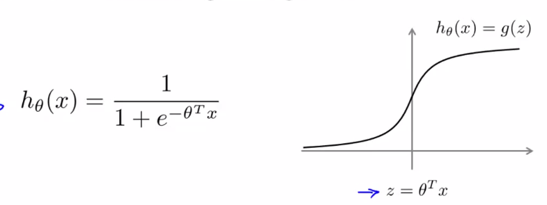
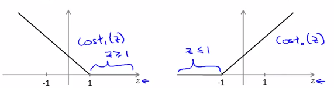
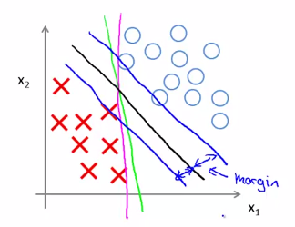
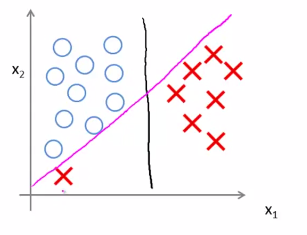
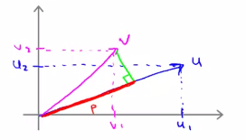
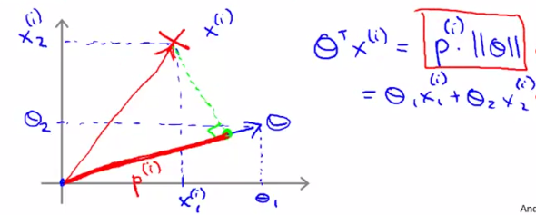
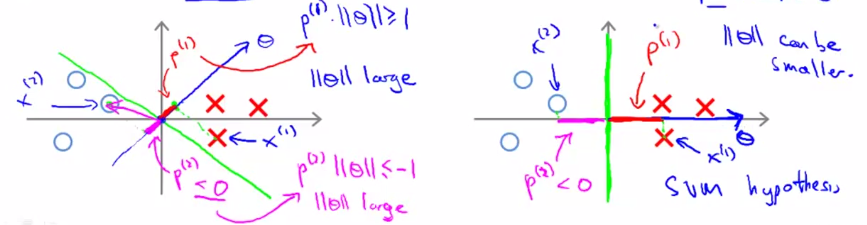

# Week 7 Lecture Notes

[TOC]
# Optimization Objective

The **Support Vector Machine** (SVM) is yet another type of *supervised* machine learning algorithm. It is sometimes cleaner and more powerful.

Recall that in logistic regression, we use the following rules:

if y=1, then $h_θ(x)≈1$ and $Θ^Tx≫0$

if $y=0$, then $h_θ(x)≈0$ and $Θ^Tx≪0$

Recall the cost function for *(unregularized) logistic regression:*
$$
\begin{align*}J(\theta) & = \frac{1}{m}\sum_{i=1}^m -y^{(i)} \log(h_\theta(x^{(i)})) - (1 - y^{(i)})\log(1 - h_\theta(x^{(i)}))\\ & = \frac{1}{m}\sum_{i=1}^m -y^{(i)} \log\Big(\dfrac{1}{1 + e^{-\theta^Tx^{(i)}}}\Big) - (1 - y^{(i)})\log\Big(1 - \dfrac{1}{1 + e^{-\theta^Tx^{(i)}}}\Big)\end{align*}
$$
***Aside Notation***:  

* $θ^Tx=z$
* $x^{i}$ is a vector of the ith training set    

### The cost function of an SVM

We will redefine the terms from the *logistic regression cost functions* by using a [hinge loss function](https://en.wikipedia.org/wiki/Hinge_loss)

**1)** We consider $y=1$, all that remains is the first term of the cost function $-\log(h_{\theta}(x)) = -\log\Big(\dfrac{1}{1 + e^{-\theta^Tx}}\Big)$. We will now modify it:

This new function will be defined as follows:

- $\theta^Tx=z>1 \text{ then } -log(h_\theta(x))=0$. 
- $z<1$ , we shall use a **straight decreasing line** instead of the sigmoid curve.

**2)** We consider $y=0$, all that remains is the first term of the cost function  $−\log(1−h_θ(x))=−\log(1−\frac{1}{1+e−θ^Tx})$ We will now modify it:

This new function will be defined as follows:

- $z<-1 \text{ then } \log(1−h_θ(x)) = 0$ 

- $z>-1 \text{ then }$ use a **straight increasing line** instead of the sigmoid curve.

  

#### Hinge Loss Function 

We shall denote these as $\text{cost}_1(z)$ and $\text{cost}_0(z)$; respectively.

* $\text{cost}_1(z)$:  cost for classifying when $y=1$
* $\text{cost}_0(z)$: cost for classifying when $y=0$ 

We may define them as follows (where $k$ is an arbitrary constant defining the magnitude of the slope of the line):

$z=θ^Tx$

* $\text{cost}_0(z)=\max(0,k(1+z))$
* $\text{cost}_1(z)=\max(0,k(1−z))$

Recall the full cost function from (regularized) logistic regression:

$$
J(\theta) = \frac{1}{m} \sum_{i=1}^m y^{(i)}(-\log(h_\theta(x^{(i)}))) + (1 - y^{(i)})(-\log(1 - h_\theta(x^{(i)}))) + \dfrac{\lambda}{2m}\sum_{j=1}^n \Theta^2_j
$$
*Note* that the negative sign has been distributed into the sum in the above equation.

We may transform this into the cost function for support vector machines by substituting $\text{cost}_0(z)$ and $\text{cost}_1(z)$:
$$
J(\theta) = \frac{1}{m}\sum_{i=1}^m \left(y^{(i)} \ \text{cost}_1(\theta^Tx^{(i)}) + (1 - y^{(i)}) \ \text{cost}_0(\theta^Tx^{(i)})\right)  + \dfrac{\lambda}{2m}\sum_{j=1}^n \Theta^2_j
$$
We can optimize this a bit by multiplying this by m (thus removing the m factor in the denominators). Note that this does not affect our optimization, since we're simply multiplying our cost function by a positive constant 
$$
J(\theta) =\sum_{i=1}^m \left(y^{(i)} \ \text{cost}_1(\theta^Tx^{(i)}) + (1 - y^{(i)}) \ \text{cost}_0(\theta^Tx^{(i)})\right)  + \dfrac{\lambda}{2}\sum_{j=1}^n \Theta^2_j
$$
**For example:** minimizing $(u−5)^2+1$ gives us 5; multiplying it by 10 to make it $10(u−5)^2+10$ still gives us 5 when minimized.

Furthermore, convention dictates that we regularize using a factor $C$, instead of $λ$, like so:
$$
J(\theta) = C\sum_{i=1}^m \left(y^{(i)} \ \text{cost}_1(\theta^Tx^{(i)}) + (1 - y^{(i)}) \ \text{cost}_0(\theta^Tx^{(i)})\right) + \dfrac{1}{2}\sum_{j=1}^n \Theta^2_j
$$
This is equivalent to multiplying the equation by $C=\dfrac{1}{λ}$, and thus results in the same values when optimized. 

**Overfitting & Underfitting**

- Regularize more / reduce overfitting $\rightarrow$ *decrease* C,
- Regularize less / reduce underfitting $\rightarrow$ *increase* C.

### Hypothesis output

The hypothesis of the Support Vector Machine is *not* interpreted as the probability of y being 1 or 0 (as it is for the hypothesis of logistic regression). Instead, it outputs either 1 or 0. (In technical terms, it is a **discriminant function**.)
$$
h_\theta(x) =\begin{cases}    1 & \text{if} \ \Theta^Tx \geq 0 \\    0 & \text{otherwise}\end{cases}
$$

# Large Margin Intuition

A useful way to think about Support Vector Machines is to think of them as *Large Margin Classifiers*.

If $y=1$, we want $\theta^Tx≥1$ (not just ≥0)

If $y=0$, we want $\theta^Tx≤−1$ (not just <0)

***What about C?***

If we set our constant C to a very **large** value (e.g. 100,000), our optimizing function will constrain $\theta$ such that the first summation term of the cost function equals 0. Recall that $\theta$ is constrained by the following:

* $\theta^Tx≥1$ if y=1 
* $\theta^Tx≤−1$ if y=0.

If $C$ is very large, we must choose $\theta$ parameters such that:

$$
\sum_{i=1}^m y^{(i)}\text{cost}_1(\theta^Tx) + (1 - y^{(i)})\text{cost}_0(\theta^Tx) = 0
$$
(In order to have the cost function not be skewed by the large $C$)

This reduces our cost function to:
$$
\begin{align*}
J(\theta) = C \cdot 0 + \dfrac{1}{2}\sum_{j=1}^n \theta^2_j \newline
= \dfrac{1}{2}\sum_{j=1}^n \theta^2_j
\end{align*}
$$
**Recall** the decision boundary from logistic regression (the line separating the positive and negative examples). In SVMs, the decision boundary has the special property that it is **as far away as possible** from both the positive and the negative examples.

The distance of the decision boundary to the nearest example is called the **margin**. Since SVMs maximize this margin, it is often called a *Large Margin Classifier*.

The SVM will separate the negative and positive examples by a **large margin**.

**NOTE**  the large margin is only achieved when **$C$ is very large**.

Data is **linearly separable** when a **straight line** can separate the positive and negative examples.

If we have **outlier** examples that we don't want to affect the decision boundary, then we can **reduce** $C$.

**Managing $C$**

Increasing and decreasing C is similar to respectively decreasing and increasing $λ$, and can simplify our decision boundary.

When $C$ is very big outliers will sway the decision boundary to situations like the magenta line. While if we reduce $C$ slightly the decision boundary will look like the black line (ignoring the outlier)

# Mathematics Behind Large Margin Classification (Optional)

### **Vector Inner Product**

Say we have two vectors, u and v:

$$
\begin{align*}
u = 
\begin{bmatrix}
u_1 \newline u_2
\end{bmatrix}
& v = 
\begin{bmatrix}
v_1 \newline v_2
\end{bmatrix}
\end{align*}
$$
The **length of vector v** is denoted $||v||$, and it describes the line on a graph from origin (0,0) to (v1,v2).

The length of vector v can be calculated with $\sqrt{v_1^2 + v_2^2}$ by the Pythagorean theorem.

The **projection** of vector v onto vector u is found by taking a right angle from u to the end of v, creating a right triangle.

- $p = \text{ length of projection of v onto the vector u}$.
- $u^Tv=p⋅||u||$

Note that $u^Tv=||u||⋅||v||\cosθ$ where θ is the angle between u and v. Also, $p=||v||\cosθ$. If you substitute $p$ for $||v||\cosθ$, you get $u^Tv=p⋅||u||$.

So the product $u^Tv$ is equal to the length of the projection times the length of vector u.

In our example, since u and v are vectors of the same length, $u^Tv=v^Tu$.

$u^Tv=v^Tu=p⋅||u||=u_1v_1+u_2v_2$

**NOTE:**  the **angle** between the lines for v and u is **greater than 90 degrees**, then the projection p will be **negative**.

Our cost function (when $C$ is large) can be expressed in terms of the length of $\theta:$ (where $n=2$ and $\theta_0=0$)
$$
\begin{align*}&\min_\theta \dfrac{1}{2}\sum_{j=1}^n \theta_j^2 \newline&= \dfrac{1}{2}(\theta_1^2 + \theta_2^2 + \dots + \theta_n^2) \newline&= \dfrac{1}{2}(\sqrt{\theta_1^2 + \theta_2^2 + \dots + \theta_n^2})^2 \newline&= \dfrac{1}{2}||\theta ||^2 \newline\end{align*}
$$
We can use the same rules to rewrite $\theta^Tx^{(i)}$:
$$
\theta^Tx^{(i)} = p^{(i)} \cdot ||\theta || = \theta_1x_1^{(i)} + \theta_2x_2^{(i)} + \dots + \theta_n x_n^{(i)}
$$

So we now have a new **optimization objective** by substituting $p^{(i)}⋅||\theta||$ in for $\theta^Tx^{(i)}$:

If $y=1$, we want $p^{(i)}⋅||\theta||≥1$

If $y=0$, we want $p^{(i)}⋅||\theta||≤−1$

The reason this causes a "large margin" is because: the vector for Θ is perpendicular to the decision boundary. In order for our optimization objective (above) to hold true, we need the absolute value of our projections $p^{(i)}$ to be as large as possible.

**Illustration:**

When $p^{(1)}$ is small(left image) $\Rightarrow \text{need large } ||\theta|| \because p^{(1)}||\theta||\geq1$  (for $p^{(2)}$, the same holds but the inequality is reversed).
But recall that we are minimizing  $\dfrac{1}{2}||\theta ||^2$, so our optimal solution occurs when $p^{(i)}$ is large(right image) and $||\theta||$ is small.   

If $Θ_0=0$, then all our decision boundaries will intersect (0,0). If $Θ_0≠0$, the support vector machine will still find a large margin for the decision boundary.

# Kernels I

**Kernels** allow us to make complex, non-linear classifiers using Support Vector Machines.

Given x, compute new feature depending on proximity to landmarks $l(1), l(2), l(3)$.

To do this, we find the "similarity" of x and some landmark $l^{(i)}$:

$$
f_i = \text{similarity}(x, l^{(i)}) = \exp(-\dfrac{||x - l^{(i)}||^2}{2\sigma^2})
$$
This "similarity" function is called a **Gaussian Kernel**. It is a specific example of a kernel.

The similarity function can also be written as follows:
$$
f_i = \text{similarity}(x, l^{(i)}) = \exp(-\dfrac{\sum^n_{j=1}(x_j-l_j^{(i)})^2}{2\sigma^2})
$$
There are a couple properties of the similarity function:

If $x≈l(i)$, then $f_i = \exp(-\dfrac{\approx 0^2}{2\sigma^2}) \approx 1$

If $x$ is far from $l(i)$, then $f_i = \exp(-\dfrac{(large\ number)^2}{2\sigma^2}) \approx 0$

In other words, if x and the landmark are close, then the similarity will be close to 1, and if x and the landmark are far away from each other, the similarity will be close to 0.

Each landmark gives us the features in our hypothesis:
$$
\begin{align*}l^{(1)} \rightarrow f_1 \newline l^{(2)} \rightarrow f_2 \newline l^{(3)} \rightarrow f_3 \newline\dots \newline h_\Theta(x) = \Theta_1f_1 + \Theta_2f_2 + \Theta_3f_3 + \dots\end{align*}
$$
$σ^2$ is a parameter of the Gaussian Kernel, and it can be modified to increase or decrease the **drop-off** of our feature $f_i$. Combined with looking at the values inside $Θ$, we can choose these landmarks to get the general shape of the decision boundary.

# Kernels II

One way to get the landmarks is to put them in the **exact same** locations as all the training examples. **This gives us *$m$ landmarks*, with one landmark per training example.**

Given example x:

$f_1 = \text{similarity}(x,l^{(1)})$, $f_2 = \text{similarity}(x,l^{(2)})$, $f_3 = \text{similarity}(x,l^{(3)})$ and so on.

This gives us a ***"feature vector,"*** $f_{(i)}$ of all our features for example $x_{(i)}$. We may also set $f_0=1$ to correspond with $Θ_0$. Thus given training example $x_{(i)}$:
$$
x^{(i)} \rightarrow \begin{bmatrix}f_1^{(i)} = similarity(x^{(i)}, l^{(1)}) \newline f_2^{(i)} = similarity(x^{(i)}, l^{(2)}) \newline\vdots \newline f_m^{(i)} = similarity(x^{(i)}, l^{(m)}) \newline\end{bmatrix}
$$
Now to get the parameters Θ we can use the SVM minimization algorithm but with $f^{(i)}$ substituted in for $x^{(i)}$:

$$
\min_{\Theta} C \sum_{i=1}^m y^{(i)}\text{cost}_1(\Theta^Tf^{(i)}) + (1 - y^{(i)})\text{cost}_0(\theta^Tf^{(i)}) + \dfrac{1}{2}\sum_{j=1}^n \Theta^2_j
$$
Using kernels to generate $f^{(i)}$ is not exclusive to SVMs and may also be applied to logistic regression. However, because of computational optimizations on SVMs, kernels combined with SVMs is much faster than with other algorithms, so kernels are almost always found combined only with SVMs.

### **Choosing SVM Parameters**

Choosing $C$ (recall that $C=\dfrac{1}{λ}$

- If C is large, then we get higher variance/lower bias
- If C is small, then we get lower variance/higher bias

The other parameter we must choose is $σ^2$ from the Gaussian Kernel function:

With a large $σ^2$, the features fi vary more smoothly, causing higher bias and lower variance.

With a small $σ^2$, the features $f^{(i)}$ vary less smoothly, causing lower bias and higher variance.

**Using An SVM**

There are lots of good SVM libraries already written. A. Ng often uses `liblinear` and `libsvm`. In practical application, you should use one of these libraries rather than rewrite the functions.

In practical application, the choices you do need to make are:

- Choice of parameter C
- Choice of kernel (similarity function)
- No kernel ("linear" kernel) -- gives standard linear classifier
- Choose when n is large and when m is small
- Gaussian Kernel (above) -- need to choose σ2
- Choose when n is small and m is large

The library may ask you to provide the kernel function.

**Note:** do perform feature scaling before using the Gaussian Kernel.

**Note:** not all similarity functions are valid kernels. They must satisfy "Mercer's Theorem" which guarantees that the SVM package's optimizations run correctly and do not diverge.

You want to train C and the parameters for the kernel function using the training and cross-validation datasets.

### **Multi-class Classification**

Many SVM libraries have multi-class classification built-in.

You can use the *one-vs-all* method just like we did for logistic regression, where $y∈1,2,3,…,K$ with $\Theta^{(1)}, \Theta^{(2)}, \dots,\Theta{(K)}$. We pick class i with the largest $(\Theta^{(i)})^Tx$.

### **Logistic Regression vs. SVMs**

If n is large (relative to m), then use logistic regression, or SVM without a kernel (the "linear kernel")

If n is small and m is intermediate, then use SVM with a Gaussian Kernel

If n is small and m is large, then manually create/add more features, then use logistic regression or SVM without a kernel.

In the first case, we don't have enough examples to need a complicated polynomial hypothesis. In the second example, we have enough examples that we may need a complex non-linear hypothesis. In the last case, we want to increase our features so that logistic regression becomes applicable.

**Note**: a neural network is likely to work well for any of these situations, but may be slower to train.

# Additional references

- "An Idiot's Guide to Support Vector Machines":[http://web.mit.edu/6.034/wwwbob/svm-notes-long-08.pdf](http://web.mit.edu/6.034/wwwbob/svm-notes-long-08.pdf)