# ML:Anomaly Detection

# Problem Motivation

Just like in other learning problems, we are given a dataset x(1),x(2),…,x(m).

We are then given a new example, xtest, and we want to know whether this new example is abnormal/anomalous.

We define a "model" p(x) that tells us the probability the example is not anomalous. We also use a threshold ϵ (epsilon) as a dividing line so we can say which examples are anomalous and which are not.

A very common application of anomaly detection is detecting fraud:

- x(i)= features of user i's activities
- Model p(x) from the data.
- Identify unusual users by checking which have p(x)<ϵ.

If our anomaly detector is flagging **too many** anomalous examples, then we need to **decrease** our threshold ϵ

# Gaussian Distribution

The Gaussian Distribution is a familiar bell-shaped curve that can be described by a function N(μ,σ2)

Let x∈ℝ. If the probability distribution of x is Gaussian with mean μ, variance σ2, then:

$x \sim \mathcal{N}(\mu, \sigma^2)$

The little ∼ or 'tilde' can be read as "distributed as."

The Gaussian Distribution is parameterized by a mean and a variance.

Mu, or μ, describes the center of the curve, called the mean. The width of the curve is described by sigma, or σ, called the standard deviation.

The full function is as follows:
$$
\large p(x;\mu,\sigma^2) = \dfrac{1}{\sigma\sqrt{(2\pi)}}e^{-\dfrac{1}{2}(\dfrac{x - \mu}{\sigma})^2}
$$
We can estimate the parameter μ from a given dataset by simply taking the average of all the examples:
$$
\mu = \dfrac{1}{m}\displaystyle \sum_{i=1}^m x^{(i)}
$$
We can estimate the other parameter, σ2, with our familiar squared error formula:
$$
\sigma^2 = \dfrac{1}{m}\displaystyle \sum_{i=1}^m(x^{(i)} - \mu)^2
$$

# Algorithm

Given a training set of examples, ${x^{(1)},…,x^{(m)}}$ where each example is a vector, x∈Rn.
$$
p(x) = p(x_1;\mu_1,\sigma_1^2)p(x_2;\mu_2,\sigma^2_2)\cdots p(x_n;\mu_n,\sigma^2_n)
$$
In statistics, this is called an "independence assumption" on the values of the features inside training example x.

More compactly, the above expression can be written as follows: **(Known as the problem of *Density Estimation*)**
$$
= \displaystyle \prod^n_{j=1} p(x_j;\mu_j,\sigma_j^2)
$$
**The algorithm**

1) Choose features $x_i$ that you think might be indicative of anomalous examples.

2) Fit parameters $\mu_1,\dots,\mu_n,\sigma_1^2,\dots,\sigma_n^2$ 

​	(Calculating across all the training examples for a particular feature $j$ )

​	Calculate $\mu_j = \dfrac{1}{m}\displaystyle \sum_{i=1}^m x_j^{(i)}$

​	Calculate $\sigma^2_j = \dfrac{1}{m}\displaystyle \sum_{i=1}^m(x_j^{(i)} - \mu_j)^2$

3) Given a new example x, compute p(x):

​	$p(x) = \displaystyle \prod^n_{j=1} p(x_j;\mu_j,\sigma_j^2) = \prod\limits^n_{j=1} \dfrac{1}{\sqrt{2\pi}\sigma_j}exp(-\dfrac{(x_j - \mu_j)^2}{2\sigma^2_j})$

​	Anomaly if $p(x)<ϵ$

A vectorized version of the calculation for μ is $\mu = \dfrac{1}{m}\displaystyle \sum_{i=1}^m x^{(i)}$. You can vectorize $σ^2$ similarly.

## Example

Say we have the following data set with features $x_1$ and $x_2$ 

We then get the variance and distribution of each feature - shown bellow. 

Combining each features respective probability distribution into $p$ we get the following graph. 

*The question begs, are the new examples anomalies?*

We then get the following results:

i.e. $x^1$ has a high probability of not being an anomaly. While $x^2$ has a high anomaly of being an anomaly. 

This can be interpreted as the following:

Where everything in the pink area is likely of being an anomaly.

Similarly, for the following; everything in the shaded area can be though of as being likely of being an anomaly. 

# Developing and Evaluating an Anomaly Detection System

To evaluate our learning algorithm, we take some labeled data, categorized into anomalous and non-anomalous examples.

**Convention:** **( $y = 0$ if normal, $y = 1$ if anomalous).**

Among that data, take a large proportion of **good**, ***non-anomalous data*** for the training set on which to train $p(x)$.

Then, take a smaller proportion of mixed anomalous and non-anomalous examples (you will usually have many more non-anomalous examples) for your cross-validation and test sets.

**For Example:**

1. We may have a set where 0.2% of the data is anomalous. 
2. We take 60% of those examples, all of which are good (y=0) for the **training set.** 
3. We then take 20% of the examples for the **cross-validation set** (with 0.1% of the anomalous examples) 
4. and another 20% from the **test set** (with another 0.1% of the anomalous).

In other words, we split the data **60/20/20 *training/CV/tes*t** and then *split the anomalous examples 50/50 between the CV and test sets.*

**Algorithm evaluation:**

Fit model $p(x)$ on training set ${x^{(1)},…,x^{(m)}}$
On a cross validation/test example x, predict:

​	If $p(x) < ϵ$ (**anomaly**), then $y=1$

​	If $p(x) ≥ ϵ$ (**normal**), then $y=0$

Possible evaluation metrics (see "Machine Learning System Design" section):

- True positive, false positive, false negative, true negative.
- Precision/recall
- $F_1$ score

**Note:** We can use the cross-validation set to choose parameter $ϵ$

# Anomaly Detection vs. Supervised Learning

In the last section we used labeled data to test our model and find optimal parameters. So the question begs; why use an unsupervised ML model for data that we could use a supervised ML model on? 

**Use anomaly detection when...**

- We have a very small number of positive examples (y=1 ... 0-20 examples is common) and a large number of negative (y=0) examples.
- We have many different "types" of anomalies and it is hard for any algorithm to learn from positive examples what the anomalies look like; *future anomalies* may look nothing like any of the anomalous examples we've seen so far.

**Use supervised learning when...**

- We have a large number of both positive and negative examples. In other words, the training set is more evenly divided into classes.
- We have enough positive examples for the algorithm to get a sense of what new positives examples look like. The future positive examples are likely similar to the ones in the training set.

## Some Applications:

**NOTE:** for example if you are a large retailer with alot of fraud, that problem could be dealt with a supervised ML model. 

# Choosing What Features to Use

The features will greatly affect how well your anomaly detection algorithm works.

We can check that our features are **gaussian** by plotting a histogram of our data and checking for the bell-shaped curve.

## Non-Gaussian Features

Some **transforms** we can try on an example feature $x$ that does not have the bell-shaped curve are:

- $\log(x)$
- $\log(x+1)$
- $\log(x+c)$ for some constant
- $\sqrt x$
- $x^{1/3}$

We can play with each of these to try and achieve the gaussian shape in our data.

## Error analysis for anomaly detection: (Feature Engineering)

There is an **error analysis procedure** for anomaly detection that is very similar to the one in supervised learning.

Our goal is for p(x):

* to be large for normal examples 
* small for anomalous examples.

**One common problem** 
is when p(x) is similar for both types of examples. Changing $\epsilon$ won't fix this problem, we need to think about features. 

(Image bellow, green point is actually an anomaly but is classified otherwise)

In this case, you need to examine the anomalous examples that are giving high probability in detail and try to figure out new features that will better distinguish the data.

In general, **choose features that might take on unusually large or small values in the event of an anomaly.**

# Multivariate Gaussian Distribution (Optional)

The multivariate gaussian distribution is an extension of anomaly detection and may (or may not) catch more anomalies.

Instead of modeling p(x1),p(x2),… separately, we will model p(x) all in one go. Our parameters will be: μ∈Rn and Σ∈Rn×n
$$
p(x;\mu,\Sigma) = \dfrac{1}{(2\pi)^{n/2} |\Sigma|^{1/2}} exp(-1/2(x-\mu)^T\Sigma^{-1}(x-\mu))
$$
The important effect is that we can model oblong gaussian contours, allowing us to better fit data that might not fit into the normal circular contours.

Varying Σ changes the shape, width, and orientation of the contours. Changing μ will move the center of the distribution.

Check also:

- [The Multivariate Gaussian Distribution](http://cs229.stanford.edu/section/gaussians.pdf) <http://cs229.stanford.edu/section/gaussians.pdf> Chuong B. Do, October 10, 2008.

# Anomaly Detection using the Multivariate Gaussian Distribution (Optional)

When doing anomaly detection with multivariate gaussian distribution, we compute μ and Σ normally. We then compute p(x) using the new formula in the previous section and flag an anomaly if p(x) < ϵ.

The original model for p(x) corresponds to a multivariate Gaussian where the contours of p(x;μ,Σ) are axis-aligned.

The multivariate Gaussian model can automatically capture correlations between different features of x.

However, the original model maintains some advantages: it is computationally cheaper (no matrix to invert, which is costly for large number of features) and it performs well even with small training set size (in multivariate Gaussian model, it should be greater than the number of features for Σ to be invertible).

# ML:Recommender Systems

# Problem Formulation

**Core Idea: ** every user helps catalog movies 

Recommendation is currently a very popular application of machine learning.

Say we are trying to recommend movies to customers. We can use the following definitions

- $n_u$= number of users
- $n_m$= number of movies
- $r(i,j)=1$ if user $j$ has rated movie $i$
- $y(i,j)=$ rating given by user $j$ to movie $i$ (defined only if $r(i,j)=1$)

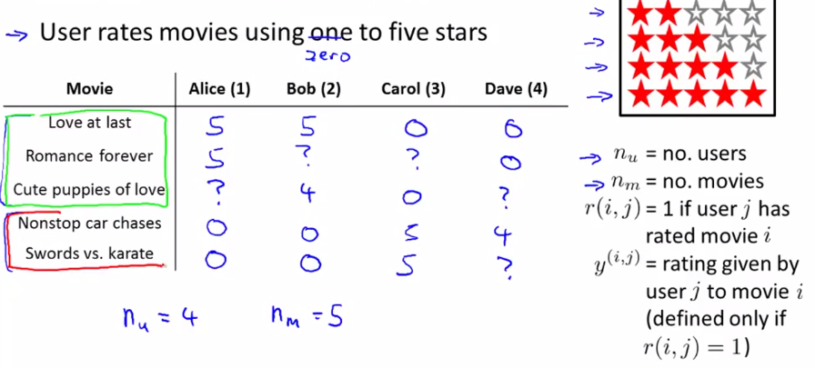

# Content Based Recommendations

We can introduce two features, $x_1$ and $x_2$ which represents how much romance or how much action a movie may have (on a scale of 0−1).

One approach is that we could do linear regression for every single user. For each user j, learn a parameter $θ(j)∈R^3$. Predict user $j$ as rating movie $i$ with $(θ^{(j)})^Tx^{(i)}$ stars.

- $θ^{(j)}$= parameter vector for user j
- $x^{(i)}$= feature vector for movie i

For user $j$, movie $i$, predicted rating: $(\theta^{(j)})^T(x^{(i)})$

- $m^{(j)}$= number of movies rated by user $j$

To learn $θ^{(j)}$, we do the following

$$
min_{\theta^{(j)}} = \dfrac{1}{2}\displaystyle \sum_{i:r(i,j)=1} ((\theta^{(j)})^T(x^{(i)}) - y^{(i,j)})^2 + \dfrac{\lambda}{2} \sum_{k=1}^n(\theta_k^{(j)})^2
$$
This is our familiar linear regression. 
**NOTE:** base of the first summation is choosing all $i$ such that $r(i,j)=1$.

To get the parameters $\theta$ for all our users, we do the following:

$$
min_{\theta^{(1)},\dots,\theta^{(n_u)}} = \dfrac{1}{2}\displaystyle \sum_{j=1}^{n_u}  \sum_{i:r(i,j)=1} ((\theta^{(j)})^T(x^{(i)}) - y^{(i,j)})^2 + \dfrac{\lambda}{2} \sum_{j=1}^{n_u} \sum_{k=1}^n(\theta_k^{(j)})^2
$$
We can apply our linear regression gradient descent update using the above cost function.

The only real difference is that we **eliminate the constant **$\frac{1}{m}$.

**TERM:** ***Content Basses Recommendations***
This particular algorithm is called a content based recommendations, or a content based approach, because we assume that we have available to us features for the different movies.

# Collaborative Filtering

**Interesting Property:** Feature learning, algorithm that will learn for it self what features to learn. 

It can be very difficult to find features such as "amount of romance" or "amount of action" in a movie. To figure this out, we can use *feature finders*.

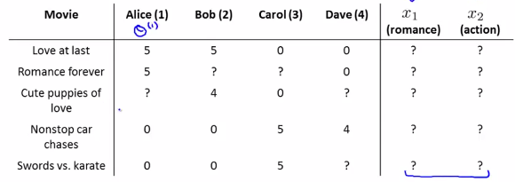

We can let the users tell us how much they like the different genres, providing their parameter vector immediately for us.

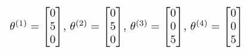

Using the feedback from our users we can then find the values for $x_1$ and $x_2$. As an example, the first movie, we are trying to find $x_1$ s.t.:

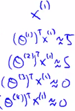

**Optimization Algorithm:**

To infer the features from given parameters, we use the squared error function with regularization over all the users:

Given $\theta^{(1)},...,\theta^{(n)}$, to learn $x^{(1)},...,x^{(i)}$: (we are choosing the feature values $x$ to minimize the squared error of the cost function)

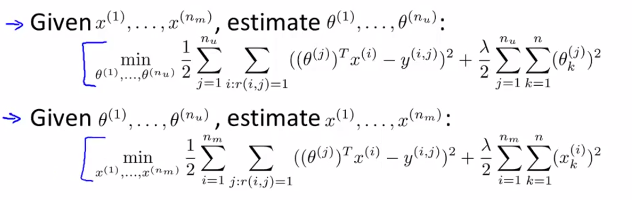

Out of the two variables $\theta$ and $x$, which one to we calculate first? and how do we calculate it if its dependent on the other?
You can also **randomly guess** the values for $\theta$ to guess the features repeatedly. You will actually converge to a good set of features.

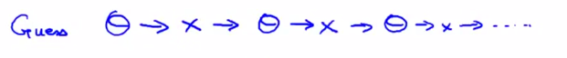

# Collaborative Filtering Algorithm

To speed things up, we can simultaneously minimize our features and our parameters:
$$
J(x,\theta) = \dfrac{1}{2} \displaystyle \sum_{(i,j):r(i,j)=1}((\theta^{(j)})^Tx^{(i)} - y^{(i,j)})^2 + \dfrac{\lambda}{2}\sum_{i=1}^{n_m} \sum_{k=1}^{n} (x_k^{(i)})^2 + \dfrac{\lambda}{2}\sum_{j=1}^{n_u} \sum_{k=1}^{n} (\theta_k^{(j)})^2
$$
It looks very complicated, but we've only combined the cost function for theta and the cost function for $x$.

**NOTE:** Because the algorithm can learn them itself, the bias units where $x_0=1$ have been removed, therefore $x∈ℝ^n$ and $θ∈ℝ^n$. This is possible because the algorithm is learning all its features, so if a feature equal to 1 is required the algorithm will produce it.

**These are the steps in the algorithm:**

1. Initialize $x^{(i)},...,x^{(n_m)},\theta^{(1)},...,\theta^{(n_u)}$ to small random values. This serves to break symmetry and ensures that the algorithm learns features $x^{(i)},...,x^{(n_m)}$ that are different from each other.

2. Minimize $J(x^{(i)},...,x^{(n_m)},\theta^{(1)},...,\theta^{(n_u)})$ using gradient descent (or an advanced optimization algorithm).E.g. for every $x^{(i)},...,x^{(n_m)}$:
   $$
   x_k^{(i)} := x_k^{(i)} - \alpha\left (\displaystyle \sum_{j:r(i,j)=1}{((\theta^{(j)})^T x^{(i)} - y^{(i,j)}) \theta_k^{(j)}} + \lambda x_k^{(i)} \right) \\
   \theta_k^{(j)} := \theta_k^{(j)} - \alpha\left (\displaystyle \sum_{i:r(i,j)=1}{((\theta^{(j)})^T x^{(i)} - y^{(i,j)}) x_k^{(i)}} + \lambda \theta_k^{(j)} \right) \text{ for } k \neq 0
   $$
   ​

3. For a user with parameters $θ$ and a movie with (learned) features $x$, predict a star rating of $θ^Tx$.

**i.e** user $j$ has not rated movie $i$, we predict that user $j$ is going to rate movie $i$ according to: $(\theta^{(j)})^Tx^{(i)}$

**Note:** there's no special case where $k=0$ because $x_0 = 1$ doesn't exist. 

# Vectorization: Low Rank Matrix Factorization

Given matrices $X$ (each row containing features of a particular movie) and $Θ$ (each row containing the weights for those features for a given user), then the full matrix Y of all predicted ratings of all movies by all users is given simply by: $Y = X\Theta^T$.

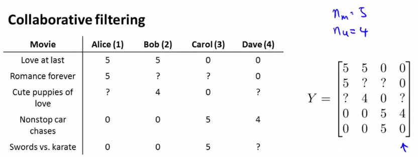

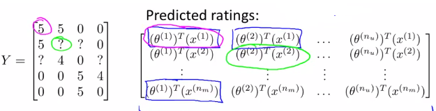

**Now define:**

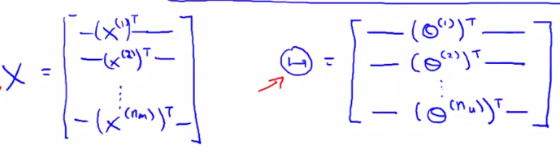

Then this lets us write $Y$ in vectoried form:
$$
\Theta^TX \\
\text{or} \\
X\Theta^T
$$

### Find related movies:

For each product $i$, we learn a feature vector $x^{i}\in R$ 

How to find movies $j$ related to movie $i$?

Having learned the feature vectors. We can use the distance between their respective feature vectors x. Specifically, we are looking for a small value of $||x^{(i)} - x^{(j)}||$.

# Implementation Detail: Mean Normalization

If the ranking system for movies is used from the previous lectures, then new users (who have watched no movies), will be assigned new movies incorrectly. Specifically, they will be assigned $θ$ with all components equal to zero due to the minimization of the regularization term. **That is, we assume that the new user will rank all movies 0, which does not seem intuitively correct.**

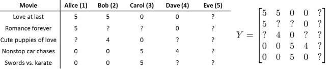

*Example: new user regularization of $\theta$*

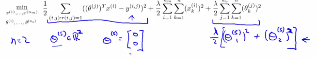

**Solution**

We rectify this problem by *normalizing the data relative to the mean*. First, we use a matrix Y to store the data from previous ratings, where the ith row of $Y$ is the ratings for the $ith$ movie and the $jth$ column corresponds to the ratings for the $jth$ user.

We can now define a vector

$$
\mu  = [\mu_1, \mu_2, \dots , \mu_{n_m}]
$$
such that

$$
\mu_i = \frac{\sum_{j:r(i,j)=1}{Y_{i,j}}}{\sum_{j}{r(i,j)}}
$$
Which is effectively the mean of the previous ratings for the ith movie (where only movies that have been watched by users are counted). We now can normalize the data by subtracting u, the mean rating, from the actual ratings for each user (column in matrix Y):

**As an example**, consider the following matrix Y and mean ratings $μ$:

$$
Y = 
\begin{bmatrix}
    5 & 5 & 0 & 0 & ?  \newline
    4 & ? & ? & 0  & ? \newline
    0 & 0 & 5 & 4 & ?\newline
    0 & 0 & 5 & 0 & ?\newline
\end{bmatrix}, \quad
 \mu = 
\begin{bmatrix}
    2.5 \newline
    2  \newline
    2.25 \newline
    1.25 \newline
\end{bmatrix}
$$
The resulting Y′ vector is:

$$
Y' =
\begin{bmatrix}
  2.5    & 2.5   & -2.5 & -2.5 & ? \newline
  2      & ?     & ?    & -2 & ? \newline
  -.2.25 & -2.25 & 3.75 & 1.25  & ?\newline
  -1.25  & -1.25 & 3.75 & -1.25 & ?
\end{bmatrix}
$$
Now we must slightly modify the linear regression prediction to include the mean normalization term:
(For user $j$, on movie $i$ predict:)
$$
(\theta^{(j)})^T x^{(i)} + \mu_i
$$
Now, for a new user, the initial predicted values will be equal to the $μ$ **term** instead of simply being initialized to zero, which is more accurate.

**Example (cont.)**

Our normalization term still goes to $0$ but we have that new $\mu$ term.

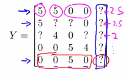

**NOTE:** The same idea can be applied to movies with no ratings.