# Week 1

[TOC]

## Scope of Machine Learning

* Database mining 
* Applications that can't be implemented 
* Self-customizing programs 
* Understand human learning 

##### ***Definition***: Machine Learning

A computer program is said to *learn* from *Experience* $E$ with some *Task* $T$ and some performance measure $P$ if its performance on $T$, measured by $P$, improves with *Experience* $E$

### Types of Machines Learning

1. Supervised Learning
2. Unsupervised Learning
3. Reinforced Learning
4. Recommender systems

## Supervised Learning

##### ***Definition:*** Regression Problem

 Predict results within a continuous output

##### ***Definition:*** Classification Problem

Predict results in a discrete output

##### Question: Infinite Number of Features?

How do we make computers handle this? 
-> ==Support Vector Machine== (dealt with later)

## Unsupervised Learning

Unsupervised learning allows us to approach problems with little or no idea what our results should look like. We can derive structure from data where we don't necessarily know the effect of the variables.

We can derive this structure by *clustering the data based* on relationships among the variables in the data.

With unsupervised learning there is no feedback based on the prediction results.

**Notice** how the diagram doesn't have defined labels. 

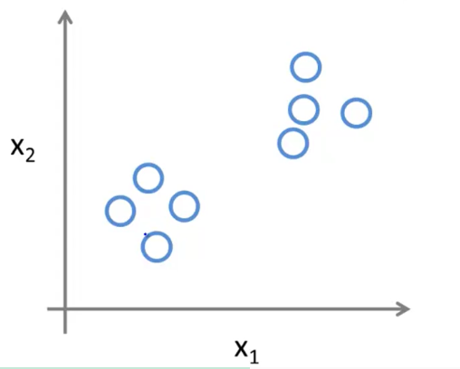

***Algorithm Example:*** Clustering

Clusters data according to similar properties it defines by it self

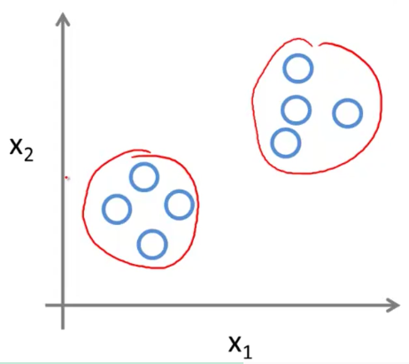

##### ***Application Example:*** Cocktail Problem

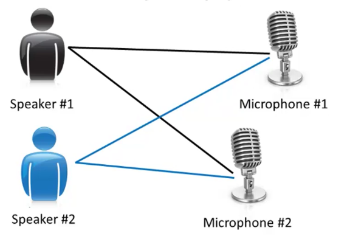

By clustering identity by itself the 2 separate frequencies -> we can isolate the individual speakers

This can be done with the following code:

```octave
[W,s,v] = svd((repmat(sum(x.*x,1),size(x,1),1).*x)*x);
## Where svd -> single value devision
```

## Model and Cost Function

### Linear Regression with one variable - Univariate Linear Regression


* $h_\theta = \theta_0 + \theta_1x $
* $h: X \rightarrow Y$

***Properties:*** 

* Supervised Learning
* Regression Problem

##### Notation:

$$
m = \text{training examples} \\
x = \text{input var / feature} \\
y = \text{output var / target} \\
(x,y) - \text{one training example} \\
(x^{(i)},y^{(i)}) - \text{ith training example} \\
i - \text{training set} \\ 
X - \text{space of input values} \\
Y - \text{space of output values}
$$

##### Structure:

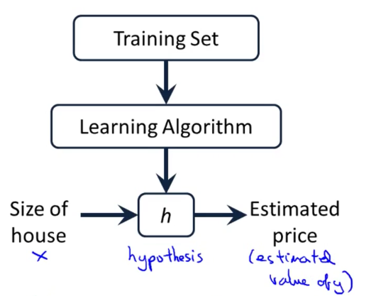

### Cost Function

##### ***Definition***: Parameters

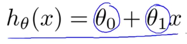

#### **Formalized Cost function for Linear Regression**

*How do we determine the parameters?*

Choose $\theta_0,\theta_1$ so that $h$ is close to $y$ for our training example $(x,y)$

##### *Squared Error Function / Mean squared error:*

This is the most common function used for regression problems but there are others.
$$
J(\theta_0,\theta_1) =  \frac{1}{2m} \sum^m_{i=1} \left(h_\theta x^{(i)} - y ^{(i)}\right)^2 \\
$$

##### ***Vectorised*** - Cost Function

$$
J(\theta) = \dfrac {1}{2m} (X\theta - \vec{y})^{T} (X\theta - \vec{y})
$$

##### *Minimize the Square Error Function*

$$
min_{\theta_0,\theta_1} J(\theta_0,\theta_1)
$$

Where $J$ is our ==Cost Function==

***NOTE:***

* $\frac{1}{2m}$ - Average term - the 2 is there to simplify the derivative
* $ \sum^m_{i=1} \left(h_\theta x^{(i)} - y ^{(i)}\right)^2$ - Squared error difference term

#### Intuition 1

*Simplified problem for example:*

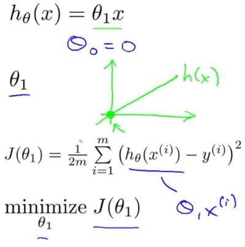

*Determine the cost for $\theta_1$*

We can see that the function minimizes at $\theta_1=1$

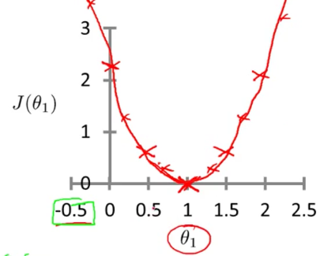

***Messy comparison for intuition***

Here a single iteration was done, the blue line shows the "error distance" the hypothesis function was from the actual plots (red x's)


*The graphs bellow:* Look at the cost function $J$ value (colour- RHS) corresponding to the same colour plot of the hypothesis function $h_\theta$ on the LHS

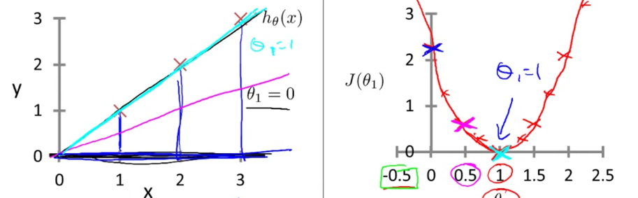

#### Intuition 2

***Example is done for the following***

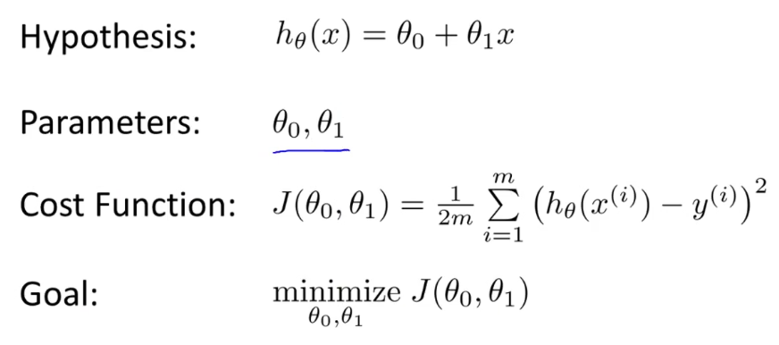

***3d surface plot of $J(\theta_1,\theta_2)$ according to the different parameter values***

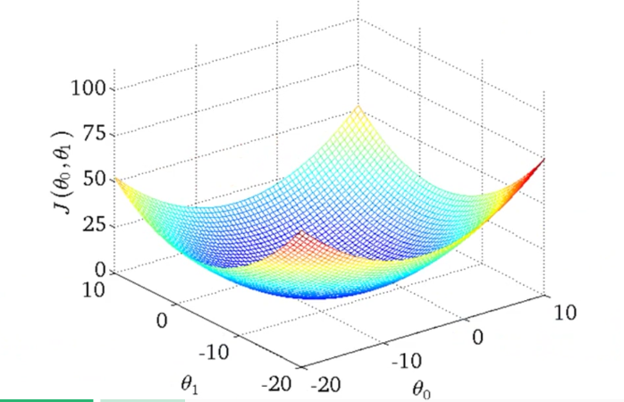

***Contour plots***

* Think of it as cross sections of the 3d plot.
* How close the lines in the contour plots are to one another illustrates the gradient of the function. Color illustrates the value of $J$ , Red->Blue, darker Blue-> closer to 0 
* Taking any color and going along the 'circle', one would expect to get the same value of the cost function.

Now look at x on the RHS and the corresponding plot on the LHS

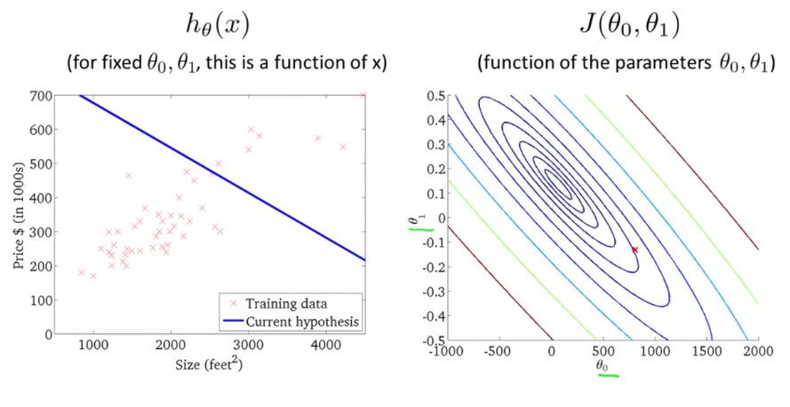

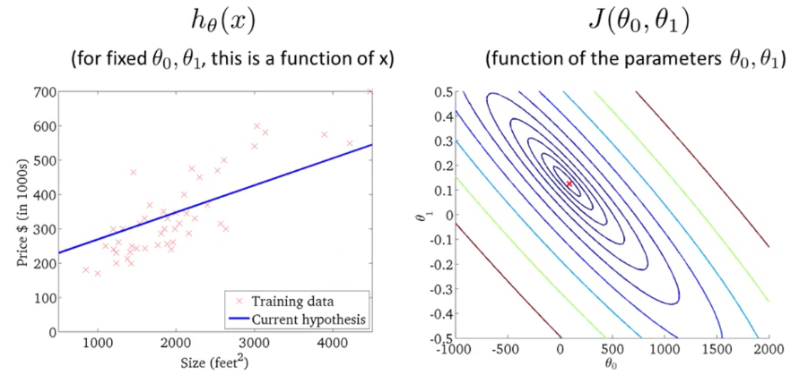

## Parameter Learning 

### ***Algorithm*** Gradient Descent

General algorithm to optimize functions.
$$
min_{\theta_0...\theta_n} J(\theta_0...\theta_n)
$$
***Outline***

* Start with some $\theta_0,\theta_1$
* Keep changing $\theta_0,\theta_1$ to reduce $J(\theta_0,\theta_1)$ until we find the minimum

***Property:***

* Only find the *local optimal solution*
* The bellow graphs show this

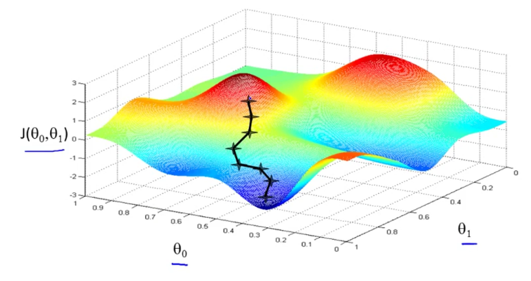

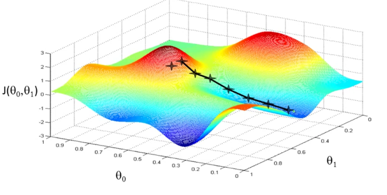

#### Algorithm

$$
\theta_j := \theta_j - \alpha\frac{\partial}{\partial\theta_j}J(\theta_0,\theta_1) \text{ for } j=0,1
$$

*Idea:* Simultaneously update $\theta_0,\theta_1$

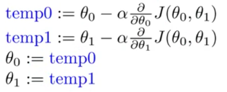

***Terms***

* $\alpha$ - learning rate 
  * control how big a step we take for each iteration 
* $ \frac{\partial}{\partial\theta_j}J(\theta_0,\theta_1)$ - gradient term
* $ \alpha\frac{\partial}{\partial\theta_j}J(\theta_0,\theta_1) $ - gradient descent term 

***Notation:***

* $a := b$  "Assignment"
* $ a = b$ "Truth assertion"

### Intuition 

##### Gradient Term

Regardless of the slope's sign for $\frac{d}{d\theta_1} J(\theta_1)$, $\theta_1$ eventually converges to its minimum value. The following graph shows that when the slope is negative, the value of $θ_1$ increases and when it is positive, the value of $θ_1$ decreases.


##### Learning Rate

We should adjust our parameter α to ensure that the gradient descent algorithm converges in a reasonable time

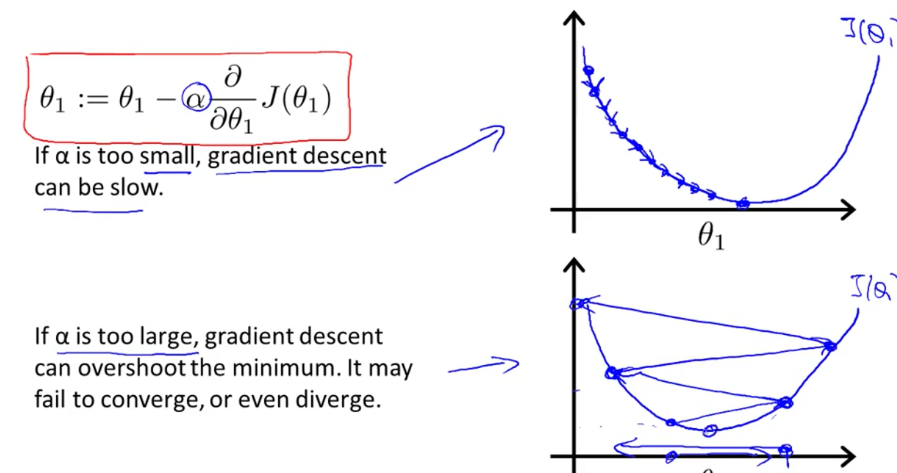

##### Convergence

As the gradient term gets closer to the local optimal point, its value get closer to 0, then the gradient descent term as a whole gets smaller for every iteration. 

### Gradient Descent for Linear Regression

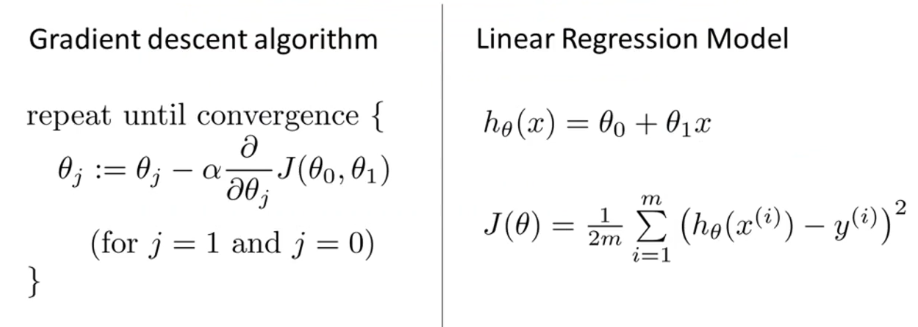

Finding the partial derivative terms:

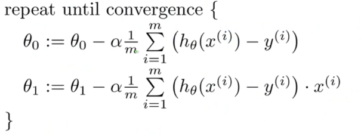

***NOTE:*** Linear regression problems are *convex function*s i.e. it has one minimum -> we don't have to worry about local / global min.

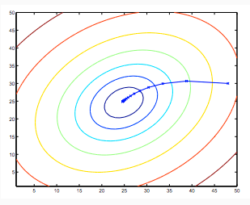

##### ***Definition:*** Batch

Each step of gradient descent uses all the training examples
i.e. the above algorithm is also know as *batch gradient descent*

**NOTE**

* Normal Equations method: method to numerically find the minimum solution
* Gradient Descent Method scales better for larger data sets


