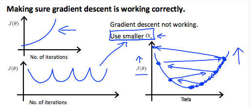
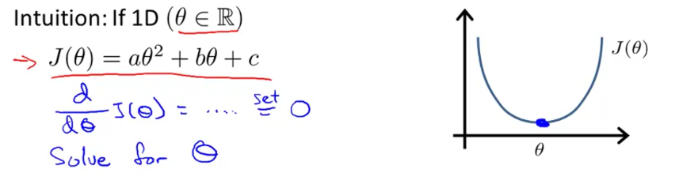

# Week 2

[TOC]

## Multivariate Linear Regression

>  Linear Regression that works with higher dimensions. 

##### ***Notation***:

$$
x_j^{(i)} = \text{value of feature } j \text{ in the }i^{th}\text{ training example} \\
x^{(i)} = \text{the column vector of all the feature inputs of the }i^{th}\text{ training example} \\
m = \text{the number of training examples} \\
n = \left| x^{(i)} \right| ; \text{(the number of features)}
$$

### Hypothesis

$$
h_\theta(x) = \theta_0 + \theta_1x_1 + ... + \theta_nx_n
$$

For convenience, define $x_0=1$, so our feature sets will be $x^{(i)}_0 = 1$. This will allow us to do matrix operations as $\theta$ and $X$ dimensions must match

$x = [x_0,..,x_n]^T \in R^{n+1}$ and $\theta = [\theta_0,..,\theta_n]^T \in R^{n+1}$

We can then define our ***hypothesis*** as:
$$
\begin{align*}h_\theta(x) =\begin{bmatrix}\theta_0 \hspace{1em} \theta_1 \hspace{1em} ... \hspace{1em} \theta_n\end{bmatrix}\begin{bmatrix}x_0 \newline x_1 \newline \vdots \newline x_n\end{bmatrix}= \theta^T x\end{align*}
$$
***Example:***

The following example shows us the reason behind setting $x^{(i)}_0 = 1$:

$X = \begin{bmatrix}x^{(1)}_0 & x^{(2)}_0 & x^{(3)}_0 \newline x^{(1)}_1 & x^{(2)}_1 & x^{(3)}_1 \end{bmatrix},\theta = \begin{bmatrix}\theta_0 \newline \theta_1 \newline\end{bmatrix}$ 

As a result, you can calculate the hypothesis as a vector with:

$h_\theta(X) = \theta^TX$ 

### Gradient Descent 

When there are n features, we define the ***cost function*** as:
$$
J(\theta) = \frac{1}{2m}\sum_{i=1}^{m}(h_\theta(x^{(i)}) - y^{(i)})^2
$$
The following are also equivalent:
$$
J(\theta) = \frac{1}{2m}\sum_{i=1}^{m}(\theta^T x^{(i)} - y^{(i)})^2 \\
J(\theta) = \frac{1}{2m}\sum_{i=1}^{m}\left(\left(\sum_{j=0}^{n}\theta_j x^{(i)}_j\right) - y^{(i)}\right)^2
$$

#### ***Vectorised:*** Cost Function


$$
J(\theta) = \dfrac {1}{2m} (X\theta - \vec{y})^{T} (X\theta - \vec{y})
$$

##### ***Algorithm:*** Gradient Descent 

*Repeat until convergence:*
$$
\theta_j := \theta_j - \alpha \frac{1}{m} \sum\limits_{i=1}^{m} (h_\theta(x^{(i)}) - y^{(i)}) \cdot x_j^{(i)} \;  \text{for j := 0...n}
$$
**Context of gradient descent w.r.t. n=1**


==Note== $x^i_0 = 1$ and the partial derivative of the cost function for $n \geq 1$

#### Speeding up Gradient Descent 

We can speed up our algorithm by having our input values in roughly the same ranges. $\theta$ will descent quickly on small ranges and slowly on large ranges. i.e oscillation occurs on the uneven surface. 

##### Feature Scaling

> Make sure features are on a **similar scale**
>
> Get every feature into approximately a $a\leq x_i \leq b$ range

*Naïve Method:* 
$$
x_i := \frac{x_i}{\text{max}(x_i)}
$$


##### Mean Normalization

> Replace $x_i$ with $x_i - \mu_i$ to make features have approximately **zero mean**

==NOTE== do not apply to $x_0=1$

*Method:* - This method will normalize and feature scale.
$$
x_i := \dfrac{x_i - \mu_i}{s_i} \\
\mu_i - \text{average of all values of feature i}\\
s_i - \text{range of values (min-max) or its the standard deviation}
$$
==NOTE== The quizzes in this course use range - the programming exercises use standard deviation.

#### Learning Rate & Debugging 

* If $\alpha$ is to small: slow convergence
* If $\alpha$ is to large: $J(\theta)$ may not decrease on every iteration; may not converge

##### Debugging gradient descent. 

Make a plot with *number of iterations* on the x-axis. Now plot the cost function, J(θ) over the number of iterations of gradient descent. If J(θ) ever increases, then you probably need to decrease α.

##### Automatic convergence test. 

Declare convergence if J(θ) decreases by less than E in one iteration, where E is some small value such as $10^{−3}$. However in practice it's difficult to choose this threshold value.

###### *Example 1:* Different Learning Rates


The learning rates: $\alpha_B << \alpha_A << \alpha_C$

In graph C, the cost function is increasing- the learning rate is to high.
Graph A,B converge to an optimum of the cost function, but graph B does so much slower due to how small $\alpha$ is.

###### *Example 2:* Oscillation

Observe what the cost function plot looks like when overshooting occurs:



#### ***Vectorized:*** Gradient Descent 

$$
\theta := \theta - \frac{\alpha}{m} X^{T} (X\theta - \vec{y})
$$

## Features

We can **combine** multiple features into one. 

***For example:***

We can combine $x_1$ and $x_2$ into a new feature $x_3 = x_1 x_2$ i.e frontage x depth, no need for two separate parameters. 


## Polynomial Regression

> We can **change the behavior or curve** of our hypothesis function by making it a quadratic, cubic or square root function (or any other form).

If our hypothesis functions is $h_\theta(x) = \theta_0 + \theta_1 x_1$, we can create additional features based on $x_1$.

$h_\theta(x) = \theta_0 + \theta_1 x_1 + \theta_2 x_1^2$

$h_\theta(x) = \theta_0 + \theta_1 x_1 + \theta_2 x_1^2 + \theta_3 x_1^3$

$h_\theta(x) = \theta_0 + \theta_1 x_1 + \theta_2 \sqrt{x_1}$

==NOTE== Scaling becomes very important when dealing with polynomials terms 

eg if $x_1$ has range 1 - 1000 then range of $x^2_1$ becomes 1 - 1000000 and that of $x^3_1$ becomes 1 - 1000000000

==NOTE:== We will look algorithms later that can determine what kind of polynomial to use

## ***Normal Equation*** - Computing Parameters Analytically

> Method for solving for $\theta$ analytically 

==NOTE== Feature scaling is not needed

##### ***Formula:*** Normal Equation 

$$
\theta = (X^T X)^{-1}X^T y
$$

Where $\theta$ is a vector containing the parameter values

##### **Terminology:** 

* $X$ - design matrix

#### Example:


#### Octave Code

```octave
pinv(x'*x)*x'*y
```

### Intuition

Here we consider the **1D** case. essentially we find the 1st derivative of the cost function and equate it to zero - as is done to find the optimal solution of the curve. 



$n$ dimensional extension


### Pros & Cons

| Gradient Descent             | Normal Equation                          |
| ---------------------------- | ---------------------------------------- |
| Need to choose alpha         | No need to choose alpha                  |
| Needs many iterations        | No need to iterate                       |
| $O (kn^2)$                   | $O (n^3)$, need to calculate inverse of $X^TX$ |
| Works well when $n$ is large | Slow if $n$ is very large                |

### Recap:

Matrix identity 


### Non-Inevitability

> What if $X^TX$ is non-invertible?

==NOTE== Octave already considers this situation with `pinv` 

#### Common Causes

- Redundant features, where two features are very closely related (i.e. they are linearly dependent)
- Too many features (e.g. m ≤ n). In this case, delete some features or use "regularization" (to be explained in a later lesson).