# Week 3

[TOC]

## Classification & Representation

##### ***Terminology*** - for binary classification

1) $y \in (0,1)$ 

* 0 - *Negative Class*
  * also denoted $-$
* 1 - Positive Class
  * also denoted $+$

2) $y^{(i)}$ - label $i$

3)  $x^{(i)}$ - feature $i$

 

##### ***Example*** - Context

Using <u>Linear Regression</u> for classification problems

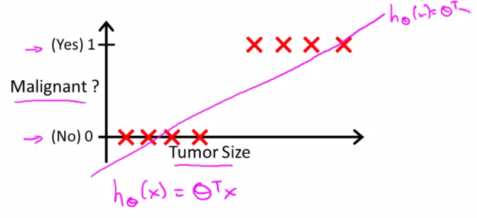

In order to make prediction, we can then ***Threshold*** the values at $0.5$ for the regression line.

* if $h_\theta(x) \geq 0.5 \rightarrow y=1$ 
* if $h_\theta(x) \leq 0.5 \rightarrow y=0$ 

==NOTE== What if we have an outlier?

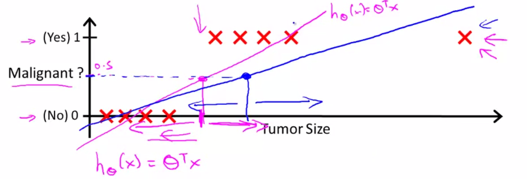

Notice how our threshold of $0.5$ moves as a result of the outlier. 
==i.e. Applying linear regression to classification isnt a good idea as it can quickly become skewed==

The hypothesis $h_\theta(x)$ can be also be > 1 or < 0 even if the labels are only meant to be y = 1,0 

## Logistic Regression Model

### Hypothesis Function

We want $0\leq h_\theta(x)\leq 1$

Recall that $h_\theta(x)=\theta^Tx$, we want it to map with respect to the bounds specified so we apply a sigmoid function $g$ onto it
$$
h_\theta(x) = g(\theta^Tx)
$$
Where $g(z)$ is the ***Sigmoid Function*** (also called the *logistic function*)
$$
g(z) = \frac{1}{1+e^{-z}}
$$


##### ***Equation*** - Logistic Regression Hypothesis

$$
h_\theta(x) = \frac{1}{1+e^{-\theta^Tx}}
$$

#### Interpretation

$h_\theta(x) = $ estimated probability that $y=1$ on input x

*Expression:*

> Probability that $y=1$, given $x$, parametrized by $\theta$
>
> $h_\theta(x)=P(y=1| x;\theta)$ 

i.e. 

* Inverse, probability of $y=0$ occurring
  * $h_\theta(x) - 1 = P(y=0| x;\theta)$
* The summation is equal to 1 
  * $P(y=1| x;\theta) + P(y=0| x;\theta) = 1$

### Decision Boundary

When is $y=1$ w.r.t $\theta^Tx$ ? 

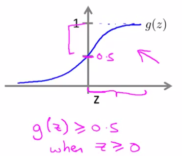

Hence, we get $y=1$ when:
$$
h_\theta(x) = g(\theta^Tx) \geq 0.5 \\
\text{when } \theta^Tx \geq 0
$$
Conversely, $y=0$ when: 
$$
h_\theta(x)=g(z) < 0.5\\
\text{when }z = \theta^Tx < 0
$$

##### ***Example:*** linear boundary

Say we have the following data:

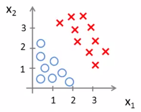

Where the hypothesis has been determined to be: 
$$
h_\theta(x) = g(-3+ 1*x_1 + 1*x_2)
$$
Then $y=1$ if:
$$
-3+x_1+x_2 \geq 0\\
x_1 + x_2 \geq 3
$$
*Plotting this inequality:*
Everything to the right of the pink line is then determined to be the "red x" region

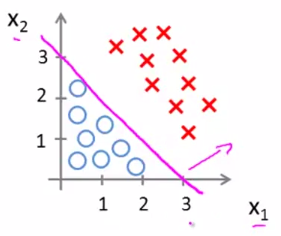

##### ***Term:*** Decision Boundary

> * The pink line in the above diagram 
> * The function that separates the classification regions
>   * In the above example: $x_1+x_2=3$
> * ==NOTE== the decision boundary is a property of the hypothesis function and its parameters and not a property of the data set

***Example:*** Non-Linear decision boundaries

Say we have the following data:

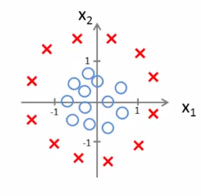

Where the hypothesis has been determined to be: 
$$
h_\theta(x) = g(-1+x_1^2+x_2^2)
$$
Then $y=1$ if:
$$
-1+x_1^2+x_2^2 \geq 0\\
x_1^2+x_2^2\geq 1
$$
*Plotting this inequality:*
Everything outside the pink circle is $y=1$

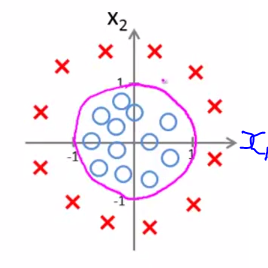

with the decision boundary defined by $x_1^2+x_2^2=1$

### Cost Function

How do we choose our parameters $\theta$?

*System Set up*

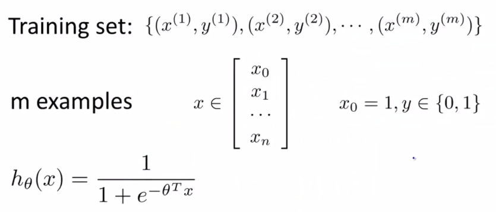


#### Context:

Recall that the *cost function* for linear regression is:
$$
J(\theta) = \frac{1}{m} \sum^m_{i=1} \frac{1}{2}\left(h_\theta(x)-y\right)^2
$$


But recall that the hypothesis for logistic regression is: (non-linear)
$$
h_\theta(x)=\frac{1}{1+e^{-\theta^Tx}}
$$
This non-linearity will produce a "non-convec" cost function when put into the cost function $J(\theta)$

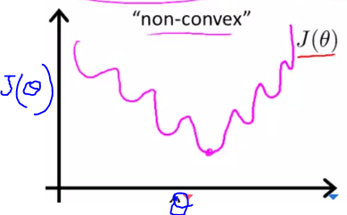

The problem with this is that we will struggle to find the global optimal solution to the cost function.
==Hence== we define a cost function that will give us a convex function which is easier to optimize. 

#### ***Function:*** Logistic Regression cost Function

$$
J(\theta)=\frac{1}{m}\sum_m^{i=1} Cost(h_\theta(x^{(i)}),y^{(i)})\\
\text{Cost}(h_\theta(x),y)=\begin{cases}
    -log(h_\theta(x)), & \text{if $y=1$}.\\
    -log(1-h_\theta(x)), & \text{if } y=0.
  \end{cases}
$$

##### ***Intuition:*** $y=1$

Plot of $-log(h_\theta(x))$ as  $J(θ)$ vs $h_θ(x)$:


Observe that:
$$
\lim_{h_\theta(x) \to 1} Cost = 0 \\
\lim_{h_\theta(x) \to 0} Cost = \infty
$$
i.e The closer the hypothesis function $h$ predicts $0$ when it should be $1$ the greater the cost value $J$ will be (rapid growth towards infinity closer to 0 we get)

***Intuition:*** $y=0$

Similar to the previous example we have the following but the inverse  

Plot of $-log(1-h_\theta(x))$ as  $J(θ)$ vs $h_θ(x)$:


 

### Simplified Cost Function

$$
\text{Cost}(h_\theta(x),y)=\begin{cases}
    -log(h_\theta(x)), & \text{if $y=1$}.\\
    -log(1-h_\theta(x)), & \text{if } y=0.
  \end{cases}
$$

We can simplify the function above into:
$$
Cost(h_\theta(x),y)=-y\log(h_\theta(x))-(1-y)\log(1-h_\theta(x))
$$

#### ***Function:*** Logistic Regression cost Function

$$
J(\theta) = - \frac{1}{m} \displaystyle \sum_{i=1}^m [y^{(i)}\log (h_\theta (x^{(i)})) + (1 - y^{(i)})\log (1 - h_\theta(x^{(i)}))]
$$

==NOTE== 

* The above cost function is convex
* This cost function can be derived from the principle of *maximum likelihood estimation* 

### Fitting Parameters - Gradient Descent 

#### ***Algorithm*** Gradient Descent

Minimizing $J(\theta)$
$$
\begin{align*} & Repeat \; \lbrace \newline & \; \theta_j := \theta_j - \frac{\alpha}{m} \sum_{i=1}^m (h_\theta(x^{(i)}) - y^{(i)}) x_j^{(i)} \newline & \rbrace \end{align*}
$$

 #### Vectorized Implementation 

##### ***Vectorized*** - Cost Function

$$
h = g(X\theta)\\
g(z) = \frac{1}{1+e^{-z}} \\
J(\theta) = \frac{1}{m} \cdot \left(-y^{T}\log(h)-(1-y)^{T}\log(1-h)\right)
$$

##### ***Vectorized*** - Updating of Gradient Descent

$$
\theta := \theta - \alpha\frac{1}{m}\sum_{i=1}^{m}[(h_\theta(x^{(i)}) - y^{(i)}) \cdot x^{(i)}]
$$

OR
$$
\theta := \theta - \frac{\alpha}{m} X^{T} (g(X \theta ) - \vec{y})
$$

### Advanced Optimization 

Example of more advanced optimization algorithms

* Conjugate gradient
* BFGS
* L-BFGS

| Advantages                         | Disadvantages |
| ---------------------------------- | ------------- |
| No need to manually pick $\alpha$  | More Complex  |
| Often faster then gradient descent |               |

##### ***Example***

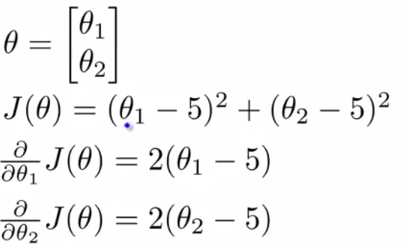

```octave
function [jVal, gradient] = costFunction(theta)
  jVal = (theta(1)-5)^5 + (theta(2)-5)^2
  
  gradient = zeros(2,1);
  gradient(1) = 2*(theta(1)-5);
  gradient(2) = 2*(theta(2)-5);
end
```

```octave
options = optimset('GradObj', 'on', 'MaxIter', 100);
initialTheta = zeros(2,1);
[optTheta, functionVal, exitFlag] = fminunc(@costFunction, initialTheta, options);
% @costFunction : a pointer to the function 
```

==NOTE== `initialTheta` $\in R^d$ where $d \geq 2$

##### Use with logistic regression 

```octave
function [jVal, gradient] = costFunction(theta)
  jVal = [...code to compute J(theta)...];
  gradient = [...code to compute derivative(s) of J(theta)...];
end
```

## Multiclass Classification 

Given a data set with 3 classes, left graph

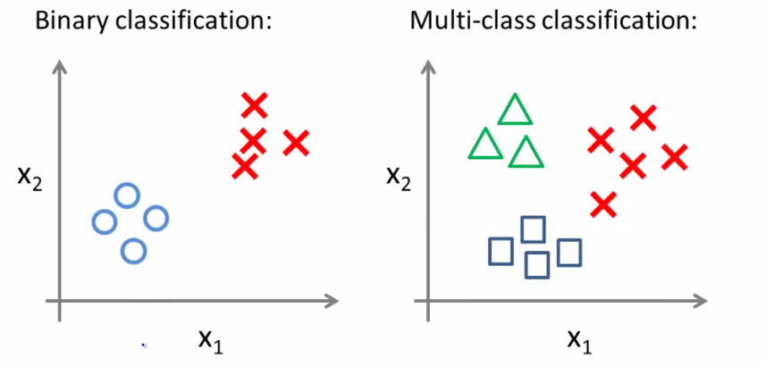

### ***Classification:*** One-VS-All

Using *one-vs-all* classification we can separate the 3 different classes. 

The idea is that we will change this problem into 3 different binary classification problems. 


Where: $h_\theta^{(i)}=P(y=i|x;\theta)$ for $i=1,2,3$

Where:

* $i=1$ triangles
* $i=2$ squares
* $i=3$ circles

#### Summary

Train a logistic regression classifier $h_\theta^{(i)}$ for each class $i$ to predict the probability that $y=i$

On a new input x, to make a prediction, pick the class $i$ that maximizes:
$$
\begin{align*}& y \in \lbrace0, 1 ... n\rbrace \newline& h_\theta^{(0)}(x) = P(y = 0 | x ; \theta) \newline& h_\theta^{(1)}(x) = P(y = 1 | x ; \theta) \newline& \cdots \newline& h_\theta^{(n)}(x) = P(y = n | x ; \theta) \newline& \mathrm{prediction} = \max_i( h_\theta ^{(i)}(x) )\newline\end{align*}
$$

## Dealing with Over-fitting -> Regularization 

##### ***Definition:*** Over-Fitting

> If we have to many features (and not enough data), the learning hypothesis may fit the training set very well $J(\theta) \approx 0$ but fail to generalize to new examples 
>
> i.e. It makes accurate prediction for examples in the training set, but it does not generalize well to make accurate predictions on new, preciously unseen examples

##### ***Definition:*** Underfitting  /  high bias

> When the form of our hypothesis function $h$ maps poorly to the trend of the data. It is usually caused by a function that is too simple or uses too few features.

##### ***Example*** Visual Illustration

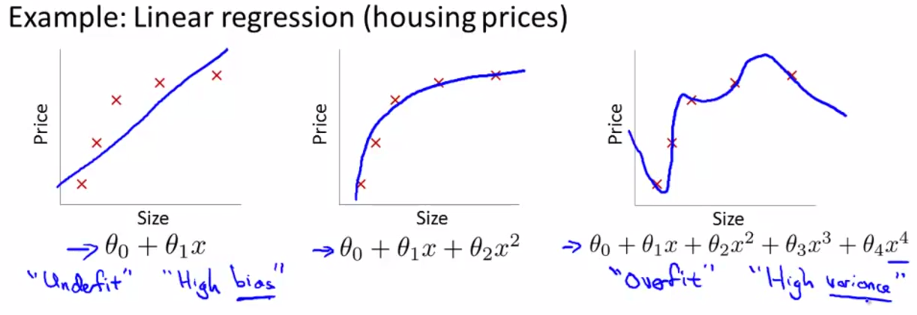

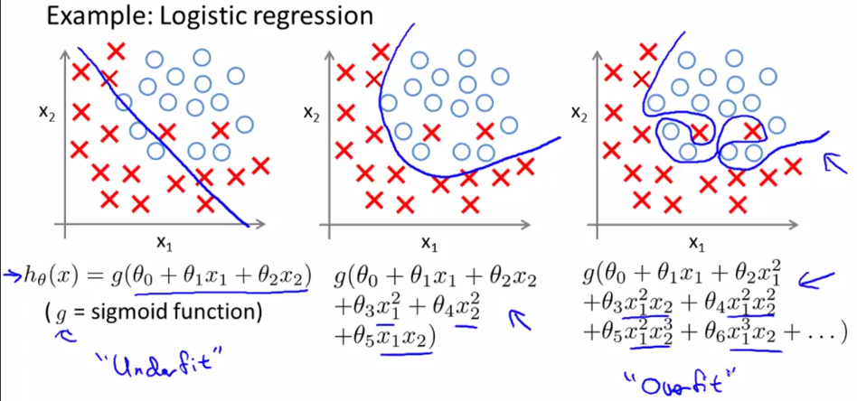

### Addressing Overfitting

* Reduce number of features
  * Manually select which features to keep
  * Model selection algorithm (later in course)
* ***Regularization***
  * Keep all the features, reduce magnitude/values of paramaters $\theta_j$
  * Works well when we have a lot of features, each of which contributes a bit to predicting $y$


### Intuition behind Regularization

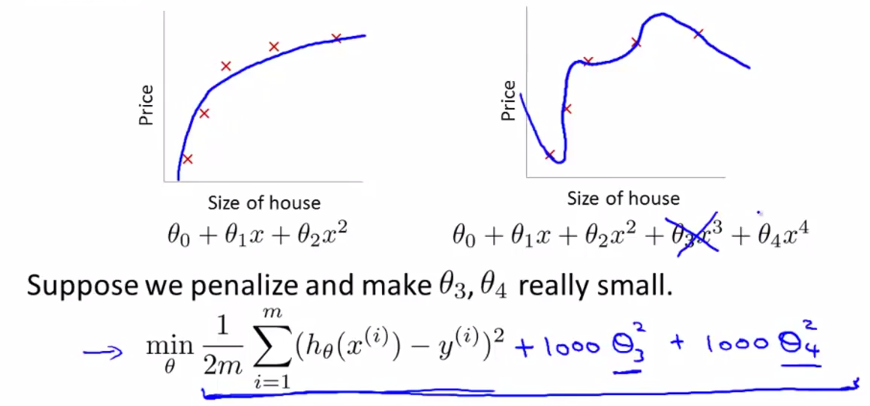

Then $\theta_3 \approx 0$ and $\theta_4 \approx 0$ -> then we get a function that resembles $\theta_0 + \theta_1x + \theta_2x^2$ 

#### Core Idea 

> Small values for parameters $\theta_0,\theta_1,...\theta_n$
>
> * Simpler hypothesis
> * Less prone to overfitting

### Solution - Cost Function for Regularization

##### ***Cost Function:*** Regularize all parameters

$$
J(\theta) = \min_\theta\ \dfrac{1}{2m}\  \sum_{i=1}^m (h_\theta(x^{(i)}) - y^{(i)})^2 + \lambda\ \sum_{j=1}^n \theta^2_j
$$

**Notation** 

* $\lambda$ : regularization parameter 

==NOTE== 

* that $\theta_0$ isn't regularized, by convention 
* The second summation term keeps the parameters small. 
* The $\lambda$ term controls the trade of  between (the two summation terms) training the data well and keeping the parameters small.
  * It determines how much the costs of our theta parameters are inflated.
  * The larger it is, the more the parameters will made small -> smooth out the function too much and cause under-fitting


### Regularized *Linear Regression*

#### ***Algorithm:***

$$
\begin{align*} & \text{Repeat}\ \lbrace \newline & \ \ \ \ \theta_0 := \theta_0 - \alpha\ \frac{1}{m}\ \sum_{i=1}^m (h_\theta(x^{(i)}) - y^{(i)})x_0^{(i)} \newline & \ \ \ \ \theta_j := \theta_j - \alpha\ \left[ \left( \frac{1}{m}\ \sum_{i=1}^m (h_\theta(x^{(i)}) - y^{(i)})x_j^{(i)} \right) + \frac{\lambda}{m}\theta_j \right] &\ \ \ \ \ \ \ \ \ \ j \in \lbrace 1,2...n\rbrace\newline & \rbrace \end{align*}
$$

* The first equation is as such because regularization isnt applied to $j=0$ 
* The second equation is obtained from $\partial J/\partial \theta_j$

The last equation is equivalent to: 
$$
\theta_j := \theta_j(1 - \alpha\frac{\lambda}{m}) - \alpha\frac{1}{m}\sum_{i=1}^m(h_\theta(x^{(i)}) - y^{(i)})x_j^{(i)}
$$
==Note== The term $(1 - \alpha\frac{\lambda}{m}) $ usually between $\in(0,1)$ acts as a shrinking term once multiplied onto parameter $\theta$ 
i.e its exactly the same as gradient descent but whe re the parameter $\theta$ is shrunk my some small amount


### Regularized *Normal Equation*

#### ***Formula:***

$$
\begin{align*}& \theta = \left( X^TX + \lambda \cdot L \right)^{-1} X^Ty \newline& \text{where}\ \ L = \begin{bmatrix} 0 & & & & \newline & 1 & & & \newline & & 1 & & \newline & & & \ddots & \newline & & & & 1 \newline\end{bmatrix}\end{align*} \\
\text{where } L \in R^{(n+1)\times(n+1)}
$$

#### Non-Inevitability

Recall that the *Normal Equation* is of the form $\theta = (X^T X)^{-1}X^T y$ 
Suppose $m \leq n$ then $X^TX$ is non-invertible/singular

*Solution:* ***Regularized form helps with this!***

As long as $\lambda > 0$ , then the term $ X^TX + \lambda \cdot L$ is *invertible* 
$$
\theta = \left( X^TX + \lambda \cdot L \right)^{-1} X^Ty
$$

### Regularized Logistic Regression 

$$
J(\theta) = - \frac{1}{m} \sum_{i=1}^m \large[ y^{(i)}\ \log (h_\theta (x^{(i)})) + (1 - y^{(i)})\ \log (1 - h_\theta(x^{(i)}))\large] + \frac{\lambda}{2m}\sum_{j=1}^n \theta_j^2
$$

#### ***Algorithm***

$$
\begin{align*} & \text{Repeat}\ \lbrace \newline & \ \ \ \ \theta_0 := \theta_0 - \alpha\ \frac{1}{m}\ \sum_{i=1}^m (h_\theta(x^{(i)}) - y^{(i)})x_0^{(i)} \newline & \ \ \ \ \theta_j := \theta_j - \alpha\ \left[ \left( \frac{1}{m}\ \sum_{i=1}^m (h_\theta(x^{(i)}) - y^{(i)})x_j^{(i)} \right) + \frac{\lambda}{m}\theta_j \right] &\ \ \ \ \ \ \ \ \ \ j \in \lbrace 1,2...n\rbrace\newline & \rbrace \end{align*}
$$

#### Advanced Optimization 

Same as last section but with modified cost function $J$

```octave
function [jVal, gradient] = costFunction(theta)
	jVal = [code to compute J]
	gradient(1) = [code to compute partial J wrt \theta_0]
	etc...
	gradient(n+1)  = [code to compute partial J wrt \theta_n]
```