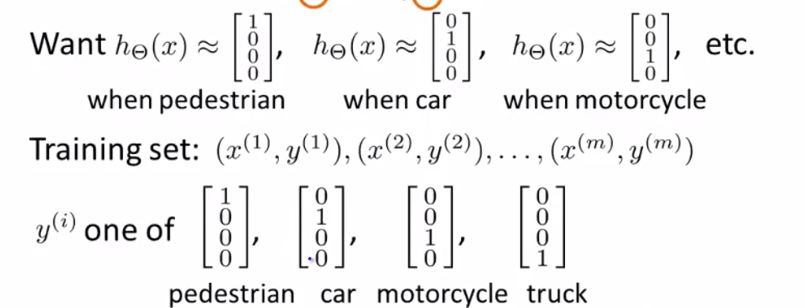

# Week 4 - Neural Networks

[TOC]

## Overview

Addresses the problem when trying to build non-linear classification . 

With logistic regression we can build new features by considering non-linear terms. For example if we have 100 features, we can then build 5000 by going to the 2nd order polynomial.  

- 2nd order polynomial features: asymptotically the number of terms grows by $O(n^2/2)$
- 2nd order polynomial features: asymptotically the number of terms grows by $O(n^3/2)$

This has a few problems:

- It can cause over fit of the training set
- It gets computationally expensive 

**Why we need non-linear classification**

Example: identifying cars from images

Using 50x50 pixel images (2500 pixels) -> features $n=2500$ and $n=7500$ if *RGB*

We will then have 3 million ($2500^2/2$) **features** if we consider quadratic features. 

*Take away:* its not feasible to consider all these features and of higher dimension 

**Solution:** Neural Networks 

## Background

Algorithms that mimic the brain.

**The core idea:** "one learning algorithm" hypothesis
It seems as if we can plug in almost any sensor to almost any part of the brain and so, within the reason, the brain will learn to deal with it. 

So the idea behind NN is that we try implement an algorithm that mimics the brains ability to process and learn from unstructured data.

## Model Representation 

1. Dendrite - input wires
2. Computation in cell body 
3. Axon  - output coile  

### Artificial Neuron model: Logistic Unit

#### Single Neuron

The following is a representation of a *single neuron* 

Where the *hypothesis function* 
$$
h_\theta=\frac{1}{1+e^{-\theta^Tx}}
$$
With our features: 
$$
x = \begin{bmatrix}x_0 \newline x_1 \newline x_2 \newline x_3 \newline \end{bmatrix}
$$
and our $\theta$ <u>parameters</u> **also called** ***Weights***
$$
\theta = \begin{bmatrix}\theta_0 \newline \theta_1 \newline \theta_2 \newline \theta_3 \newline \end{bmatrix}
$$
Recall that $x_0=1$; so it is sometimes omitted from diagrams. $x_0$ is also called the ***bias unit***

The <u>sigmoid (logistic function)</u> is also called the ***activation function***
$$
g(z)=\frac{1}{1+e^{-z}}
$$

#### Neuron Network Representation

##### Terminology:

- Layer 1: Input layer
- Layer 2: Hidden layer
  - layer that isnt an input/output layer
  - the idea is that the input/output layers we can observe but the layers between we cant exactly see what happens
- Layer 3: Output layer

##### Notation

- $a_i^{(j)}$ = "activation" of unit $i$ in layer $j$ | **activation node**
  - *"activation"* -> value that is computed by and is output by a specific neuron
- $\Theta^{(j)}$ = **matrix of weights** controlling function mapping from layer $j$ to layer $j+1$

##### Method

This process to compute $h$ in the next two sections is also called *forward propagation* - we start with the activation of the input units and forward propagate it to the hidden layer etc. 

##### Node representation

The values for each of the "activation" nodes in layer 2 and 3 is obtained as follows:
$$
\begin{align*}
a_1^{(2)} = g(\Theta_{10}^{(1)}x_0 + \Theta_{11}^{(1)}x_1 + \Theta_{12}^{(1)}x_2 + \Theta_{13}^{(1)}x_3) \newline
a_2^{(2)} = g(\Theta_{20}^{(1)}x_0 + \Theta_{21}^{(1)}x_1 + \Theta_{22}^{(1)}x_2 + \Theta_{23}^{(1)}x_3) \newline
a_3^{(2)} = g(\Theta_{30}^{(1)}x_0 + \Theta_{31}^{(1)}x_1 + \Theta_{32}^{(1)}x_2 + \Theta_{33}^{(1)}x_3) \newline
h_\Theta(x) = a_1^{(3)} = g(\Theta_{10}^{(2)}a_0^{(2)} + \Theta_{11}^{(2)}a_1^{(2)} + \Theta_{12}^{(2)}a_2^{(2)} + \Theta_{13}^{(2)}a_3^{(2)}) \newline
\end{align*}
$$
In this case $\Theta^1\in R^{3\times4}$

##### Dimension of weight matrix

$\text{If network has } s_j \text{units in layer } j \text{and } s_{j+1} \text{units in layer } j+1\text{, then }Θ^{(j)} \text{will be of dimension } s_{j+1}×(s_j+1)$

###### *Example:*

Example: layer 1 has 2 input nodes and layer 2 has 4 activation nodes. Dimension of $Θ^{(1)}$ is going to be $4×3$ where $s_j=2$ and $s_j+1=4$, so $s_j+1×(sj+1)=4×3$.

==NOTE== The hypothesis function for Neural Networks are parameterized by $\Theta$

#### Neural Network Vectorized Implantation - forward propagation 

We define a new varaible $z$ that encloses our parameters inside our $g$ function

$z^{(j)}_k =   \Theta_{k,0}^{(j-1)}x_0 + \Theta_{k,1}^{(j-1)}x_1 + \cdots + \Theta_{k,n}^{(j-1)}x_n$

our layer 1 nodes become:
$$
\begin{align*}a_1^{(2)} = g(z_1^{(2)}) \newline a_2^{(2)} = g(z_2^{(2)}) \newline a_3^{(2)} = g(z_3^{(2)}) \newline \end{align*}
$$
we can further vectorise by:

$z^{(2)} = \begin{bmatrix}z^2 \newline z^2 \newline z^2 \newline \end{bmatrix}$ and $a^{(1)}=x = \begin{bmatrix}x_0 \newline x_1 \newline x_2 \newline x_3 \newline \end{bmatrix}$

so then 
$$
z^{(2)}=\Theta^{(1)}x=\Theta^{(1)}a^{(1)} \\
a^{(2)}=g(z^{(2)})
$$
==NOTE== the sigmoid function $g$ is applied element wise onto $z^{(2)}$ 
in the above example: $a^{(2)}\in R^3$ and $z^{(2)} \in R^3$

Finally to compute the hypothesis value: 
$$
z^3=\Theta^2a^2 \\
h_\Theta(x) = a^3=g(z^3)
$$

#### Abstraction:

$$
z^{(j)} = \Theta^{(j-1)}a^{(j-1)}\\
a^{(j)}=g(z^{(j)})\\
h_Θ(x)=a^{(j+1)}=g(z^{(j+1)})
$$

#### Architecture

- The way the NN is laid out 

*Example:*

 

### Intuition 1 

Lets say we have a NN where we can only see layer 2 and 3. Our hypothesis is essentially calculated as a regression problem using the inputs from layer 2. 

Rather then calculating the hypothesis value from the feature inputs $x$ , $h$ is calculated from the new features $a^{(2)}$ **WHERE** the features from $a^{(2)}$ are them selves learned as a function of the input.

**TAKE AWAY** you aren't constrained to use the original features or polynomial expressions of the features as you are with logistic regression because of the hidden layers compute new layers outside these constraints through the $\Theta$ mapping!

### Intuition II & III

Have a look at this [markdown](../Material/Lecture Notes/Week 4 Notes.md)

### Multiclass Classification 

For when we have more then one category we would like to classify. **One-vs-ALL**

*example* 

- character image classification 
- Different objects

